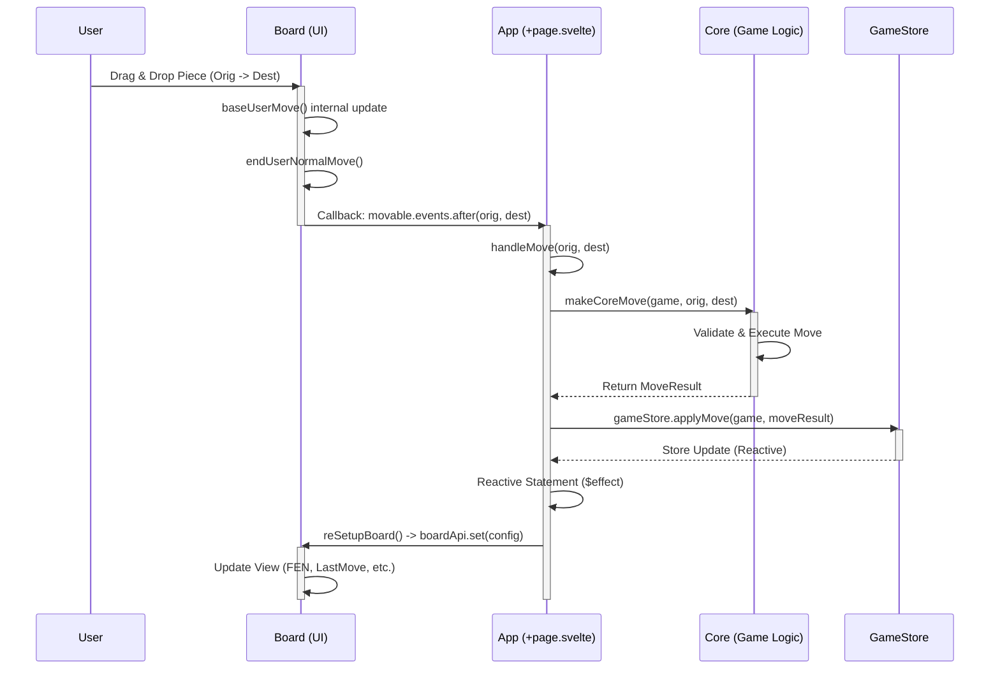

# CoTuLenh Architecture: Move & Recombine Flows

This document outlines the data and control flow for "Standard Moves" and "Recombine Actions" across the three main layers of the application:

1.  **Board (`cotulenh-board`)**: The UI / View layer.
2.  **App (`cotulenh-app`)**: The Controller / Integration layer.
3.  **Core (`cotulenh-core`)**: The Model / Game Logic layer.

## Move Flow

The move flow describes how a standard piece movement is initiated by the user, validated, executed, and reflected back in the UI.

### Flow Diagram

### Detailed Steps

1.  **Board Interaction**:
    - The user drags a piece on the visual board.
    - `board.ts` handles the drag via `selectSquare` and `userMove`.
    - Optimistic UI update happens in `baseMove`, moving the piece visually immediately.
    - Upon completion, `endUserNormalMove` triggers the configured callback `state.movable.events.after`.

2.  **App Handling**:
    - The `+page.svelte` component binds this callback to `handleMove`.
    - `handleMove` receives the origin and destination.
    - It invokes the core logic via `makeCoreMove` (or directly via `game.move` wrapper).

3.  **Core Execution**:
    - The Core validates the move (legality, turn, checks).
    - It updates the internal game state (FEN, history, turn).
    - It returns a `MoveResult` object.

4.  **State Update & Feedback**:
    - The App updates the global `gameStore` with `applyMove`.
    - Svelte's reactivity detects the change in `gameStore` (or `uiDeployState`).
    - The `$effect` block in `+page.svelte` triggers `reSetupBoard`.
    - `reSetupBoard` sends a new configuration object to the Board (including the new FEN, `lastMove` highlight, and valid destinations).
    - The Board reconciles its state with the new config, ensuring the visual state matches the logical state.

Note: Recombine operations (combining pieces during deploy) are handled automatically within `MoveSession.addMove()` in the Core layer. When a remaining piece targets a deployed square, the session detects this and executes the recombine internally.
