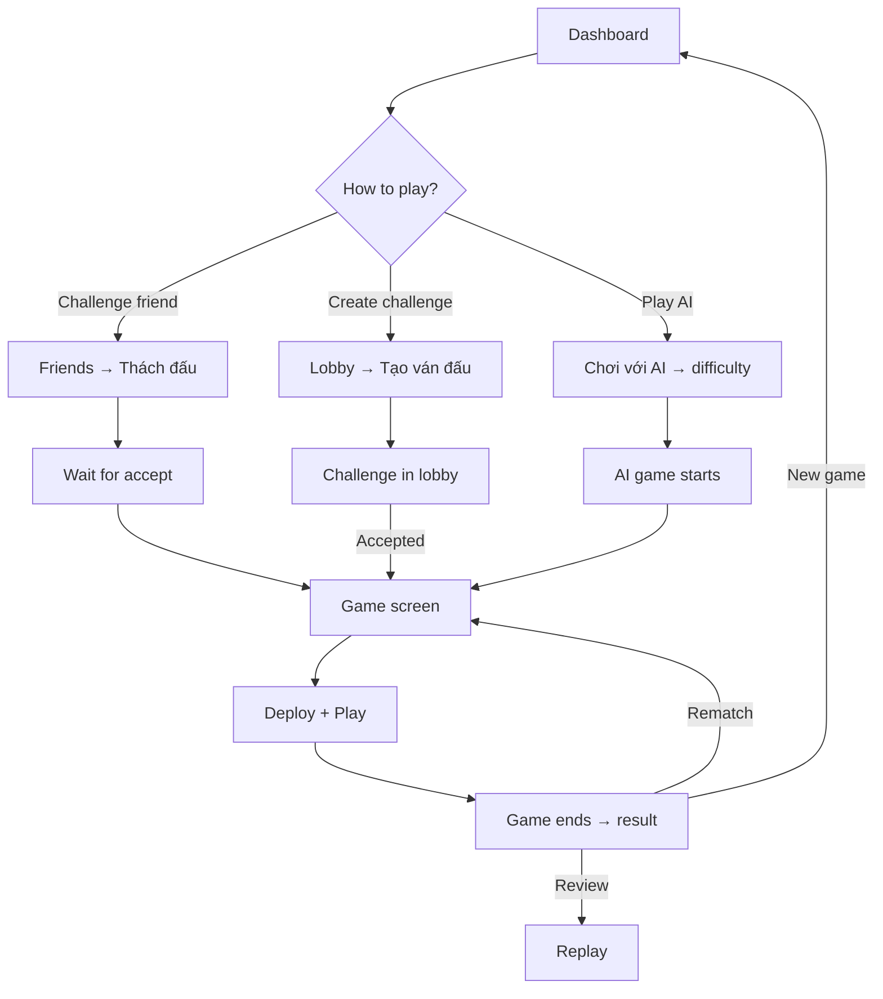
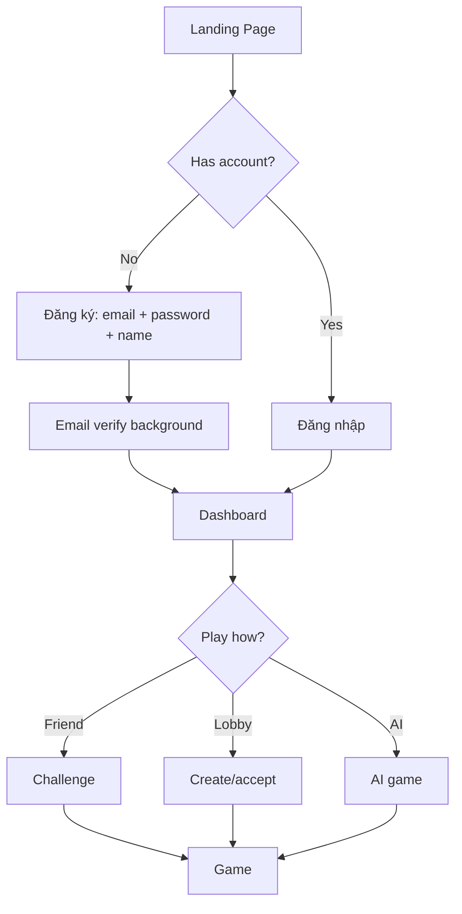
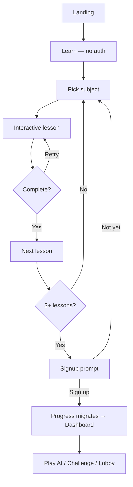
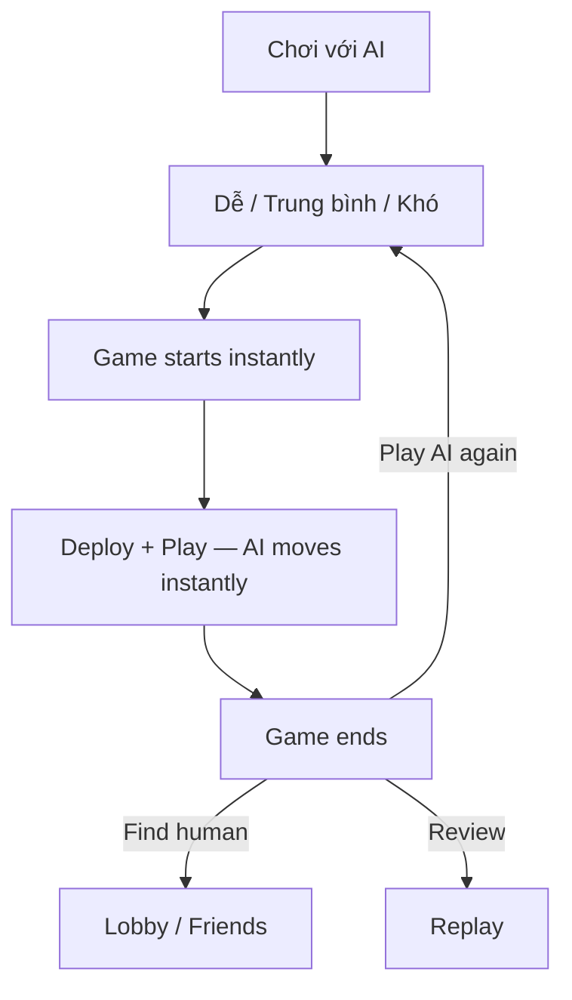
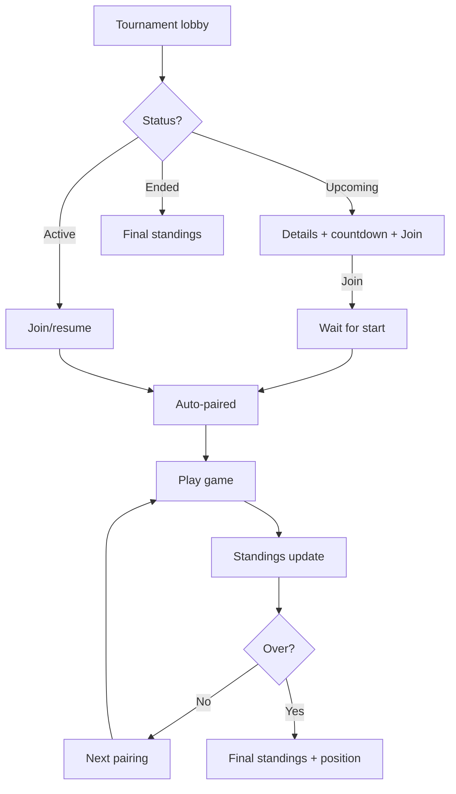

---
stepsCompleted:
  - step-01-init
  - step-02-discovery
  - step-03-core-experience
  - step-04-emotional-response
  - step-05-inspiration
  - step-06-design-system
  - step-07-defining-experience
  - step-08-visual-foundation
  - step-09-design-directions
  - step-10-user-journeys
  - step-11-component-strategy
  - step-12-ux-patterns
  - step-13-responsive-accessibility
  - step-14-complete
inputDocuments:
  - _bmad-output/planning-artifacts/prd.md
  - _bmad-output/brainstorming/brainstorming-session-2026-03-05-1309.md
  - _bmad-output/brainstorming/brainstorming-session-2026-03-06-1200.md
---

# UX Design Specification — CoTuLenh

**Author:** Noy
**Date:** 2026-03-08
**Stack:** Next.js 15 (App Router, React 19), Tailwind CSS 4, shadcn/ui, Supabase, Zustand

---

## Executive Summary

### Project Vision

Co Tu Lenh is a Vietnamese military strategy chess variant with genuine depth — deployable units, terrain mechanics, combined arms — played in school clubs, community groups, and an annual national tournament. The only online implementation (Board Game Arena) is buggy, slow, and abandoned. CoTuLenh becomes the definitive digital home.

The platform launches in Vietnamese, serving the Vietnamese community first. The experience is modeled after Lichess: board-dominant, zero-chrome, sub-second everything. The core insight: the platform must *create* players, not just serve them. The learn system is the top of the funnel. Every feature decision is filtered through "does this work when 5 people are online?"

### Target Users

**Minh — The BGA Veteran.** 28, Ho Chi Minh City. Plays seriously — weekend club matches, regional events. Uses BGA for online play. Frustrated daily by lag, desyncs, abandonment. Mobile-heavy. Speed and reliability are table stakes. Will compare everything to BGA.

**Linh — The Curious Newcomer.** 22, Hanoi. University student, chess and Xiangqi player. Finds Co Tu Lenh through search. Won't sign up to try something. Needs zero-friction learn-to-play pipeline that hooks through interactivity.

**Tuan — The Returning Learner.** 35, Da Nang. Learned as a kid, hasn't played in 10 years. Comes back through an invite link from cousin Minh. Needs low-friction signup-to-play with a rusty-player-friendly path.

### Key Design Challenges

- **Empty-room problem.** With 5 concurrent users, matchmaking queues feel broken and lobbies look dead. Every screen must feel alive even with minimal activity. AI opponent and scheduled tournaments solve the "no one to play" moment.
- **Two-phase gameplay.** Co Tu Lenh has a deploy phase (place pieces) before alternating turns. This is unique — no chess platform has modeled it. The deploy UX must be intuitive without a tutorial.
- **Conversion funnel.** The learn system must convert curious visitors into registered players without any auth gate. Progress migration from anonymous to authenticated must be invisible.
- **Mobile-first realtime.** Primary users are mobile (Minh on the bus, Tuan on his phone). Sub-second move sync on 4G, graceful disconnect handling, touch-optimized board interaction.

### Design Opportunities

- **Zero competition.** First-mover advantage to define the entire digital experience for this game. No existing UX patterns to conform to.
- **Learn system as growth engine.** Interactive lessons that are genuinely engaging can convert search traffic into players — a unique acquisition channel.
- **Community intimacy.** Small community means everyone recognizes each other on the leaderboard. Activity-based ranking makes 15 players feel like a thriving community.
- **Vietnamese identity.** Vietnamese-first design (copy, tone, cultural references) creates ownership and pride in the community.

---

## Core User Experience

### Defining Experience

The defining experience is **the moment a move syncs instantly between two players on a clean, board-dominant screen.** Everything builds toward and serves this moment. The learn system creates the player. The invite link brings them. The lobby connects them. But the game screen — board filling the viewport, move appearing in milliseconds, clocks ticking — is the product.

### Platform Strategy

- **Web-first, mobile-primary.** Next.js web app, responsive. No native app for MVP. Mobile is the primary device for target users.
- **Online-only.** No offline or PWA for MVP. Realtime multiplayer requires connectivity.
- **Vietnamese-only.** All UI copy in Vietnamese. No i18n infrastructure for MVP. English deferred to Phase 2.
- **SSR for acquisition, SPA for gameplay.** Landing page and learn hub server-rendered for SEO. Everything else client-rendered for speed.

### Effortless Interactions

| Action | Target Effort |
| --- | --- |
| Learn without signing up | 0 taps (land on /learn, start immediately) |
| Sign up | 3 fields, < 30 seconds |
| Challenge a friend | 2 taps from dashboard |
| Accept a lobby challenge | 1 tap |
| Start an AI game | 2 taps (pick difficulty, play) |
| Join a tournament | 1 tap |
| Review a past game | 1 tap from game history |
| Export PGN | 1 tap (copy to clipboard) |

### Critical Success Moments

1. **"It loads instantly."** Landing page and game page both feel immediate. Skeleton screens, system fonts, no spinners.
2. **"The move just appeared."** Sub-second sync. No lag indicator. No buffering. The board feels like a local app.
3. **"I understand deploy."** First-time player places pieces during deploy phase without confusion. The counter and visual cues are enough.
4. **"There's always someone to play."** Empty lobby → AI opponent card. No dead ends.
5. **"My progress came with me."** Learn progress migrates invisibly from localStorage to account on signup.

### Experience Principles

1. **Speed is the feature.** Sub-second everything. If users notice waiting, we've failed.
2. **The board is the star.** Minimize chrome, maximize the game. Board dominates viewport.
3. **Learn, invite, play.** The learn system creates players. Invite links bring friends. The lobby connects them.
4. **Always someone to play.** AI opponent and scheduled tournaments ensure no dead ends.
5. **Invisible infrastructure.** Auth, data sync, realtime, progress migration — users never see the machinery.
6. **Vietnamese first.** Vietnamese is the only language for MVP. Direct, factual, respectful tone.
7. **Build once, extend forever.** Navigation, layouts, and component patterns accept new features without restructuring.

---

## Desired Emotional Response

### Primary Emotional Goals

- **Speed → Trust.** Instant loads and sub-second sync build confidence that the platform is serious, maintained, and reliable. The opposite of BGA.
- **Clarity → Mastery.** Clean UI with one obvious action per screen. Users always know what to do next. Deploy mode feels understandable, not overwhelming.
- **Community → Belonging.** Friends list, activity leaderboard, arena tournaments, and invite links create the feeling of being part of something — even with 15 players.

### Emotional Journey Mapping

| Stage | Desired Feeling | Design Trigger |
| --- | --- | --- |
| Discovery (landing page) | Curiosity + impressed | Instant load, sharp board visual, "this feels serious" |
| First lesson | Ease + engagement | Interactive board, no signup required, immediate feedback |
| Signup | Speed + momentum | 3 fields, instant, straight to dashboard |
| First game (human or AI) | Excitement + "it works" | Lobby accept or AI start → board loads → playing |
| Deploy phase | Understanding + agency | Counter shows progress, undo available, visual cues guide placement |
| During gameplay | Flow + strategic tension | Instant move sync, immersive board, clock pressure |
| Rating change | Progress + motivation | Green "+12" feels earned, loss feels recoverable |
| Arena tournament | Competition + belonging | Back-to-back games, live standings, shared event |
| Leaderboard | Ambition + achievability | "I played 23 games this month — I'm #5." Reachable in small community |
| Post-game review | Analytical engagement | Move-by-move replay, "I see where I went wrong" |
| Returning | Comfort + anticipation | "My stuff is here, my friends are here, my rating is here" |

### Micro-Emotions

- **Confidence** during deploy: step counter, undo, visual piece inventory
- **Satisfaction** on move: crisp snap animation, immediate opponent acknowledgment
- **Relief** on reconnection: "Đã kết nối" (Connected) bar, game state preserved
- **Calm** during disputes: neutral language, clear options, no blame
- **Determination** after loss: "Xem lại" (Review) prominent, rating change visible, "Tái đấu" (Rematch) available

### Design Implications

| Goal | Approach |
| --- | --- |
| Flow during gameplay | Board dominates viewport, minimal chrome, no interruptions except critical events |
| Deploy confidence | Step counter ("Quân 2/4"), visual highlighting, undo available |
| Platform trust | Skeleton screens, persistent game state, instant move sync, complete game history |
| Community belonging | Friend indicators, invite links, activity leaderboard, arena tournaments |
| Post-loss motivation | "Xem lại" prominent, rating delta visible, "Tái đấu" as primary action |
| Empty-room resilience | AI opponent prominent when lobby empty, tournament schedule visible |

### Emotional Design Principles

1. **Never let users feel alone.** AI opponent and tournament schedule always visible. Empty states always have a forward path.
2. **Never let users feel lost.** One obvious primary action per screen. Consistent navigation. No dead ends.
3. **Never let users feel cheated.** Fair clocks (server-side), transparent disconnect handling, neutral dispute language.
4. **Celebrate progress, cushion loss.** Rating gains are green and animated. Losses are small red text. Review is always available.

---

## UX Pattern Analysis & Inspiration

### Inspiring Products Analysis

**Lichess.org (Primary Reference)**

Board-centric minimalism. Clean surfaces. Speed over decoration. Features added over years without redesigning the shell. Key patterns:

- Collapsed icon sidebar that never competes with the board
- Plain text tabs in game panel — extensible without restructure
- Rating badges as inline numbers, no decoration
- Toasts for non-blocking feedback
- Skeleton screens, never spinners
- Arena tournament format: time-limited, continuous pairing, join/leave freely

**Discord (Social UX)**

- Friend presence: green dots, "online" status
- Invite link flow: URL → personalized landing → signup → context preserved
- Direct challenge from friend status

**Board Game Arena (Anti-Reference)**

- Every pain point is a CoTuLenh opportunity: slow loads, desynced games, abandoned feel, confusing multi-panel game layout

### Transferable UX Patterns

| Pattern | Source | Adaptation |
| --- | --- | --- |
| Icon-only sidebar | Lichess, VS Code | Collapsed left sidebar for desktop, bottom tab bar for mobile |
| Plain text tabs | Lichess game panel | Game right panel with Moves tab (Chat in Phase 2) |
| Inline confirmation | Lichess resign/draw | Button row replaces itself with Yes/No — no modal |
| Arena tournament | Lichess arena | Time-limited, continuous pairing, live standings |
| Invite link → auto-friend | Discord invite | URL → landing → signup → friend added → challenge |
| Progressive hints | Learn UX doc | Time-based hint escalation: none → subtle → arrow → text |
| Interactive lessons | Learn UX doc | Step-through board interaction, learn-by-doing |

### Anti-Patterns to Avoid

- **BGA's multi-panel game layout.** One board, one side panel. Nothing else.
- **Chess.com's premium gates and ad clutter.** Everything free, zero monetization chrome.
- **Tutorial modals / onboarding wizards.** Product teaches by doing. No popups.
- **Empty matchmaking queues.** No Quick Play for MVP — lobby + friend + AI instead.
- **Decorative chrome.** No gradients, shadows, rounded corners. Utilitarian.

### Design Inspiration Strategy

**Adopt directly:** Lichess sidebar, plain text tabs, inline confirmations, skeleton screens, arena format.
**Adapt:** Discord invite flow (for Vietnamese context), progressive hint system (for Co Tu Lenh pieces).
**Avoid:** BGA everything, Chess.com monetization patterns, any feature that feels broken with 5 users.

---

## Design System Foundation

### Design System Choice

**shadcn/ui** — copy-paste React components built on Radix UI primitives, styled with Tailwind CSS.

### Rationale for Selection

- PRD mandates React 19 + Tailwind 4 + shadcn/ui (stack decision already made)
- Full ownership of component code (copy-paste, not dependency)
- Accessible by default (Radix primitives handle ARIA, focus management, keyboard nav)
- Tailwind 4 theming via CSS custom properties for dark/light mode
- No runtime CSS-in-JS overhead — Tailwind compiles to static CSS

### Implementation Approach

- Use shadcn/ui for all standard UI components (Dialog, Popover, Tabs, Toggle, etc.)
- Build custom game-specific components (ChessClock, MoveList, PlayerInfoBar, etc.) using Tailwind directly
- Board component (`cotulenh-board`) is vanilla TS, mounted via React ref — no shadcn involvement
- Game engine (`cotulenh-core`) is pure TS, runs client-side and in Supabase Edge Functions

### Customization Strategy

- **Design tokens** via Tailwind 4 CSS custom properties (colors, spacing, typography)
- **Dark mode default** for game screens; light mode for content-heavy screens (learn, profile)
- **0px border radius** globally — sharp, utilitarian aesthetic
- **No shadows, no gradients** — borders for elevation, flat fills only
- User theme preference persisted to localStorage / user profile

---

## Core Interaction Definition

### User Mental Model

Users think of CoTuLenh as three modes:

1. **Learn mode** — "I'm studying, show me how things work." Interactive board, instructions, hints, no pressure.
2. **Play mode** — "I'm competing, don't get in my way." Board dominates, minimal chrome, clock ticking, focus.
3. **Review mode** — "I'm analyzing, let me explore." Same board, move navigation, no clock, PGN export.

All three modes share the same board-left/panel-right layout. The mental model is consistent: board is always the center, context changes in the side panel.

### Success Criteria

| Metric | Target |
| --- | --- |
| Time from dashboard to playing (friend challenge) | < 10 seconds |
| Time from dashboard to playing (AI) | < 5 seconds |
| Learn-to-play conversion (3+ lessons → first real game) | 20%+ |
| Game completion rate (started → finished) | 90%+ |
| Move sync latency (p95) | < 500ms |

### Novel UX Patterns

**Deploy Phase UX** — No chess platform has this. Both players place deployable pieces at game start. Design requirements:
- Board shows the deploy zone (player's side) highlighted
- Piece inventory panel shows remaining deployable pieces
- Counter: "Bố trí — Quân 2/4" (Deploy — Piece 2 of 4)
- Tap inventory piece → tap board square to place
- Undo available throughout deploy
- Both players deploy simultaneously; clocks run during deploy
- Deploy complete → transition to alternating turns (clear visual shift)

**AI Opponent as Empty-Room Solution** — AI is not a secondary feature; it's the answer to "no one is online." Lobby empty state leads directly to AI. Dashboard gives AI equal prominence to multiplayer.

### Experience Mechanics

**Piece Interaction:**
- **Mobile:** Tap piece → legal moves shown as dots → tap destination → piece animates to square
- **Desktop:** Drag-and-drop + click-click both supported. Keyboard: arrow keys navigate squares, Enter selects/confirms.
- **Feedback:** Valid drop: snap 100ms. Invalid drop: animate back 150ms. Last move: highlighted squares.

**Clock Interaction:**
- Monospace tabular figures (no layout shift)
- Active player's clock highlighted
- < 30s: danger color text
- < 10s: danger background pulsing
- Paused during deploy and disconnect

---

## Visual Design Foundation

### Color System

**Semantic Color Tokens (CSS Custom Properties via Tailwind 4):**

| Token | Purpose | Light Mode | Dark Mode |
| --- | --- | --- | --- |
| `--color-primary` | Brand actions, links, active states | Deep teal | Bright teal |
| `--color-primary-hover` | Interactive hover states | Darker teal | Lighter teal |
| `--color-surface` | Page background | White/warm gray | Dark charcoal |
| `--color-surface-elevated` | Cards, panels | Light gray | Slightly lighter charcoal |
| `--color-text` | Primary text | Near-black | Off-white |
| `--color-text-muted` | Secondary text, labels | Mid-gray | Light gray |
| `--color-border` | Dividers, card borders | Light gray | Dark gray |
| `--color-success` | Valid moves, wins, rating gain | Green | Green |
| `--color-warning` | Clock pressure, cautions | Amber | Amber |
| `--color-error` | Invalid moves, errors, rating loss | Red | Red |
| `--color-info` | Hints, tooltips, status | Blue | Blue |

**Game-Specific Colors:**
- `--color-move-highlight` — Legal move indicators (semi-transparent primary)
- `--color-last-move` — Last move highlight on board squares
- `--color-deploy-active` — Deploy session mode indicator
- `--color-clock-critical` — Clock under 30 seconds (pulsing red)
- `--color-player-online` — Online indicator (green dot)

**Team Colors:**
- Red: hsl(0, 70%, 50%) / dark: hsl(0, 65%, 60%)
- Blue: hsl(210, 70%, 50%) / dark: hsl(210, 65%, 60%)
- Used as: 4px left border on player bars, 10% opacity clock tint

**Why teal:** Distinct from chess.com (green) and lichess (brown/green). Reads well in both themes. Strategy-adjacent without aggression.

### Typography System

```
--font-sans: ui-sans-serif, system-ui, -apple-system, sans-serif;
--font-mono: ui-monospace, 'Cascadia Code', 'Fira Code', monospace;
```

System fonts: zero load delay, OS-native Vietnamese diacritics.

| Token | Size | Use |
| --- | --- | --- |
| `--text-xs` | 0.75rem (12px) | Timestamps, fine print |
| `--text-sm` | 0.875rem (14px) | Labels, move list, rating badges |
| `--text-base` | 1rem (16px) | Body text, form inputs |
| `--text-lg` | 1.125rem (18px) | Card titles, section labels |
| `--text-xl` | 1.25rem (20px) | Page headings |
| `--text-2xl` | 1.5rem (24px) | Page titles |
| `--text-3xl` | 1.875rem (30px) | Hero text (landing page only) |

**Weights:** 400 body, 500 labels/nav, 600 headings/player names, 700 critical UI only (clock pressure, result banner).

**Monospace:** Move notation, PGN, clock display (tabular figures), rating numbers.

### Spacing & Layout Foundation

**Base unit: 4px.** All spacing is multiples of 4.

| Token | Value | Use |
| --- | --- | --- |
| `--space-1` | 4px | Icon-to-text gaps |
| `--space-2` | 8px | Default padding, compact lists |
| `--space-3` | 12px | Card internal padding |
| `--space-4` | 16px | Section spacing |
| `--space-6` | 24px | Card margins |
| `--space-8` | 32px | Major section breaks |
| `--space-12` | 48px | Page-level padding |
| `--space-16` | 64px | Hero spacing |

**Shape:** 0px border radius everywhere. No shadows. No gradients. Borders for elevation.

### Accessibility Considerations

- WCAG 2.1 AA target
- All text 4.5:1 contrast minimum. Interactive elements 3:1. Both themes verified independently.
- Never color alone — move highlights use color + shape (dots/rings), deploy uses border + text, clock critical uses color + size + pulse
- `prefers-reduced-motion` respected: disable animations, pulse effects
- `lang="vi"` on document root

---

## Design Direction

### Chosen Direction: Lichess Pure + Strategic Command

**Lichess Pure** as foundation: extreme board-centric minimalism. Board dominates every game page. Chrome reduced to essential controls. Surfaces clean and neutral. Teal appears only where interaction is needed.

**Strategic Command** overlay for game screens: dark mode default, subtle tactical personality in clocks, deploy counters, and status elements.

**Vietnamese Warmth** for acquisition: landing page and learn system use slightly warmer tones to welcome newcomers before transitioning to focused gameplay.

### Design Rationale

- Lichess is the gold standard for board game UX — proven across millions of users
- Dark mode default for game screens reduces eye strain during long sessions and creates focus
- Utilitarian aesthetic (0px radius, no shadows) signals "serious tool" not "casual game"
- Teal primary distinguishes from chess.com (green) and lichess (brown) while feeling strategic

---

## Navigation

### Desktop (>1024px) — Collapsed Left Sidebar

- Fixed position, always visible. Width: **48px** (icons only, never expands).
- Top section: Home, Play, Learn icons stacked vertically.
- Bottom section: Profile, Settings icons.
- Active section: 3px left border accent in primary color.
- Hover: tooltip with section name (200ms delay).
- Future sections (Tournaments, Watch, Analysis) slot between Learn and Profile.
- During active game: sidebar stays visible. Tapping non-game icons triggers "Rời ván đấu?" (Leave game?) confirmation.

### Mobile & Tablet (<1024px) — Fixed Bottom Tab Bar

- Fixed position, always visible. Height: **56px**.
- 5 icon tabs: Home, Play, Learn, Profile, More.
- "More" opens bottom drawer with overflow items (Settings, Tournaments).
- Active tab: filled icon + primary color. Inactive: outline icon + muted.
- During active game: bottom bar stays. Non-game tabs trigger leave-game confirmation.
- No labels — icons self-explanatory. 44px min touch targets.

### Page Transitions

- Next.js App Router client-side navigation. Instant route changes, no full page reload.
- No transition animations (speed over polish).
- Browser back/forward always works. Deep links for all public pages.

---

## Screen Layouts

### Landing Page (Unauthenticated)

**Purpose:** First impression. "This feels serious." Curiosity → learn or signup.

```
┌──────────────────────────────────────────────────────────┐
│  [Logo] CoTuLenh                    [Học]  [Đăng nhập]  │
├──────────────────────────────────────────────────────────┤
│                                                          │
│     Static board visual (final position of real game)    │
│                                                          │
│  "Cờ Tư Lệnh — chiến thuật quân sự Việt Nam"           │
│                                                          │
│  [Học chơi] (primary)     [Đăng ký] (secondary)         │
│                                                          │
├──────────────────────────────────────────────────────────┤
│  3 feature cards:                                        │
│  [Học miễn phí]  [Chơi với bạn bè]  [Xếp hạng]        │
└──────────────────────────────────────────────────────────┘
```

- Hero: static board, Vietnamese headline, two CTAs — "Học chơi" (Learn, primary) and "Đăng ký" (Sign up, secondary).
- Three value propositions: free lessons, play with friends, competitive ratings.
- Minimal nav: logo, learn link, sign-in. No sidebar on landing page.
- SSR-rendered for SEO. `lang="vi"`.
- Mobile: board scales to viewport. CTAs stacked full-width. Cards stacked.

### Home Dashboard (Authenticated)

**Purpose:** Command center. What can I do + what's happening.

**Desktop (>1024px) — Two columns (60/40):**

```
┌──┬──────────────────────────────────┬──────────────────────┐
│  │ Quick Actions (2x2 grid)         │ Bạn bè trực tuyến    │
│N │   [Chơi với AI] [Tạo ván đấu]   │   (online friends)    │
│A │   [Giải đấu]   [Học]            │                       │
│V │                                  │ Bảng xếp hạng        │
│  │ Ván đấu gần đây (recent games)  │   (top 5 active)      │
│  │ Giải đấu sắp tới (tournament)   │                       │
└──┴──────────────────────────────────┴──────────────────────┘
```

- Quick Actions: "Chơi với AI" (Play AI), "Tạo ván đấu" (Create Game), "Giải đấu" (Tournaments), "Học" (Learn).
- Recent Games: compact rows — opponent, result, rating change, time ago. Click → review.
- Upcoming Tournament card if scheduled.
- Right: Online Friends with "Thách đấu" (Challenge) action. Activity Leaderboard top 5.
- Mobile: single column stacked. Recent games show 5 + "Xem thêm". Friends/leaderboard collapsible.

### Play — Lobby

**Purpose:** Maximum 2 taps to start playing.

- Create Challenge form: time control (Rapid 15+10 only for MVP), Rated/Casual toggle, color choice (Random/Red/Blue), "Tìm đối thủ" (Find Opponent) button posts open challenge.
- Below: Open Challenges table + Games In Progress table side by side.
- Empty lobby: prominent AI card — "Không có đối thủ? Chơi với AI" (No opponents? Play AI).
- Mobile: form stacked. "Tìm đối thủ" full width. Challenges/games as collapsible sections.

### Game Screen

**Purpose:** The board is sacred. Everything exists to serve the board.

**Desktop (>1024px):**

```
┌──┬──────────────────────────────────┬──────────────────────┐
│  │  Opponent bar (name, rating, ⏱)  │ [Nước đi]            │
│N │                                  │ (move list)           │
│A │         BOARD                    │                      │
│V │    (max height, square ratio)    │                      │
│  │                                  │──────────────────────│
│  │  Your bar (name, rating, ⏱)     │ Game actions + nav    │
└──┴──────────────────────────────────┴──────────────────────┘
```

- **Board:** max available height, square aspect ratio. NEVER resizes when panel content changes.
- **Right panel:** 280–320px. Plain text tabs. Active = bold + underline. MVP: **Nước đi** (Moves) only. Phase 2: Chat tab. Future tabs without restructure.
- **Player bars:** name, rating badge, clock. < 30s danger color. < 10s danger background pulsing.
- **Game actions:** resign, draw, takeback — flat icon buttons, tooltip on hover. Inline confirmation (button row → Yes/No). No modal.
- **Move navigation:** ◄◄ ◄ ► ►► below move list.
- **AI variant:** Opponent bar shows "AI — Dễ/Trung bình/Khó". No clock. Always unrated. No draw/takeback.
- **Mobile:** Board full width. Bars compressed (name + clock). Panel below board as scrollable tabs. Bottom tab bar stays.
- **Tablet (640–1024px):** Same as desktop layout, bottom tab bar instead of sidebar.

### Post-Game Screen

- Result overlay ON the board (semi-transparent backdrop). Board visible.
- Result text + method. Rating change animated (rated human games only).
- Actions: **Tái đấu** (Rematch, primary), Ván mới (New Game), Xem lại (Review).
- AI variant: "Chơi lại với AI" / "Tìm đối thủ" / "Xem lại".
- Click outside overlay → board navigable for replay.
- Mobile: result banner above board (compact). Actions below.

### Arena Tournament

**Tournament Lobby:**
- Upcoming: card with name, start time, countdown, participant count, "Tham gia" (Join) button.
- Active: live standings table (Rank, Player, Score, Games, Streak). Your row highlighted. Updates within 5s.
- Between rounds: "Đang tìm đối thủ..." (Finding opponent...) with cancel.
- Past: compact results.

**In-Tournament Game:**
- Same game screen + banner: "Giải đấu — Vòng 3" (Tournament — Round 3).
- Post-game: "Tiếp tục giải đấu" (Continue tournament) instead of Rematch.
- Tournament end: full standings overlay with final position.

### Learn Hub

- "Tiếp tục học" (Continue Learning) banner: current lesson, progress bar, "Tiếp tục" button.
- Grid of 9 progressive subjects. No auth required.
- After 3+ lessons: "Sẵn sàng chơi với người thật?" (Ready to play someone real?) signup prompt.
- Mobile: single column stacked.

### Learn — Lesson View

- Same board-left/panel-right layout as game screen.
- Panel: lesson text, step counter, hint button, progress bar.
- Progressive hints: 0–10s none, 10–20s subtle pulse, 20–40s arrow, 40s+ text hint.
- Correct → green flash. Wrong → red flash + contextual hint.
- Interactive: tap piece → see legal moves → move → feedback. Learn by doing.

### Profile

- Single column (max 1200px). Player header: name, join date, W/L/D, action buttons.
- Rating card for Rapid (single time control for MVP). Game count. Activity stats.
- Recent games table (click → replay).
- Mobile: same content stacked. Rating card full width. Games as compact cards.

### Activity Leaderboard

- Table: Rank, Player, Games Played (this month), Rating, Last Active.
- Your row highlighted or pinned at bottom if off-board.
- Top 50. Paginated 20/page. Updated after every completed game.
- Mobile: horizontal scroll. Rank + Player + Games always visible.

### Friends Management

- Accessible from Profile or sidebar.
- Sections: Online Friends (with "Thách đấu"), Offline Friends, Pending Requests (accept/decline).
- Each row: avatar, name, rating, online status, last active.
- Actions: Challenge (online), View Profile, Remove (inline confirmation).
- Invite link generator: "Mời bạn bè" → shareable URL → clipboard.
- Mobile: single column cards. Sections collapsible.

### Settings

- One scrollable page. Section headers: Display (dark/light theme), Game Behavior (move confirm, takebacks), Account (password, delete).
- Immediate save on change. Toast: "Đã lưu" (3s). No save button.
- Phase 2: sound, board/piece themes, language selector.

---

## User Journey Flows

### Journey 1: Friend Challenge — The Golden Path



### Journey 2: Sign Up to First Game



### Journey 3: Learn to Play



### Journey 4: Invite Link

```mermaid
flowchart TD
    A[Invite link] --> B{Valid?}
    B -->|Yes| C["Minh mời bạn chơi"]
    B -->|Invalid| D[Error + Learn/Signup CTAs]
    C --> E{Has account?}
    E -->|No| F[Signup → auto-friend]
    E -->|Yes| G[Login]
    F --> H{Inviter online?}
    G --> H
    H -->|Yes| I[Challenge → game]
    H -->|No| J[Friends: "offline" + Play AI / Lobby]
```

**Error states:** Expired/invalid → "Liên kết không hợp lệ." + Learn/Signup CTAs. Already friends → skip, proceed to dashboard. Inviter deleted → treat as expired.

### Journey 5: Core Gameplay

- Board renders starting position.
- Deploy phase: both players place pieces. Clocks running. Counter: "Bố trí — Quân 2/4".
- Deploy complete → alternating turns.
- Your turn: tap piece → legal moves → tap destination → animate → broadcast.
- Opponent turn: their clock runs → their move animates.
- Game end: result overlay. Rating change. Rematch/Review/Home.

**Disconnection (your view):** "Đang kết nối lại..." bar. Board greyed. Both clocks pause (server-side). 60s forfeit window.

**Disconnection (opponent's view):** "Đối thủ đang kết nối lại... (còn 45 giây)" with countdown. Board visible, clocks paused. Timeout → "Đối thủ mất kết nối — bạn thắng" with "disconnection forfeit" status.

**Server-rejected move:** Piece animates back 200ms. Inline error: "Nước đi không hợp lệ". Board re-syncs from server.

**Connection failure (first connect):** "Không thể kết nối. Kiểm tra mạng." + Retry button.

### Journey 6: AI Opponent



AI games: always unrated, no clock, no rematch (loop to difficulty select). Engine runs client-side via cotulenh-core.

### Journey 7: Arena Tournament



### Journey Patterns

- **One obvious primary action** per screen. Secondary actions de-emphasized.
- **Empty state = forward path.** Lobby empty → play AI. Friends empty → invite.
- **Toast for confirmations.** Non-blocking, auto-dismiss 3s.
- **Inline for errors.** Next to the relevant element.
- **Optimistic UI.** Move appears immediately, rollback only on server rejection.
- **Invisible data sync.** Progress migration, game state persistence — no "syncing" UI.

---

## Component Strategy

### shadcn/ui Components Used

| Component | Usage |
| --- | --- |
| Dialog | Account deletion, leave rated game — irreversible only |
| Alert Dialog | Destructive confirmations (unfriend, abandon) |
| Popover | Player info card, move annotations |
| Tooltip | Sidebar labels, button labels, provisional rating hint |
| Tabs | Game right panel, profile sections, learn subjects |
| Toggle | Theme switcher |
| Avatar | Player photos/initials |
| Switch | Settings toggles |
| Card | Dashboard quick actions, friend cards, tournament cards |
| Table | Leaderboard, game history, lobby challenges |
| Separator | Section dividers |
| Label | Form labels |

### Custom Components — Game Chrome

**ChessClock** — Dual timers. States: running, paused (deploy/disconnect), critical (<30s), expired. Monospace tabular figures. `role="timer"`, `aria-live="polite"` at critical. Not rendered for AI.

**MoveList** — Scrollable notation, numbered rows. Current move highlighted, auto-scroll. States: live (auto-append), review (clickable nav), empty. Arrow keys step. `aria-current` on active.

**GameRightPanel** — 280–320px desktop, full-width mobile. Plain text tabs. MVP: Moves. Phase 2: Chat. Board never resizes on tab switch. `role="tablist"`, arrow key nav.

**DeployProgressCounter** — "Bố trí — Quân 2/4". Piece icons. States: active, waiting, complete, undo. `aria-live="assertive"`.

**GameResultBanner** — Result + method + rating delta. Overlays board bottom. Actions: Rematch/New/Review. AI variant: Play AI Again/Find Opponent/Review. `role="alertdialog"`, focus trapped.

**PlayerInfoBar** — Avatar, name, rating badge, clock, captured pieces. Top (opponent) + bottom (you). Active turn = highlighted. AI variant: "AI — Trung bình", no clock/rating. `aria-label` with full status.

**DisconnectBanner** — Your disconnect: "Đang kết nối lại..." persistent. Opponent disconnect: countdown banner. Forfeit: "Đối thủ mất kết nối — bạn thắng". `role="alert"`.

### Custom Components — Tournament

**TournamentCard** — Name, time, duration, participants, status badge. Upcoming: countdown + Join. Active: "Đang diễn ra" + Join/Rejoin.

**TournamentStandings** — Live table: Rank, Player, Score, Games, Streak. Your row highlighted. Updates <5s. Between rounds: "Đang tìm đối thủ..." banner.

### Custom Components — AI

**AIDifficultySelector** — Three buttons: Dễ / Trung bình / Khó. Brief description each. Selecting starts game immediately.

### Custom Components — Application

**RatingBadge** — Inline monospace. Established: plain number. Provisional: number + "?". Unrated: "—". Tooltip on provisional.

**RatingChangeDisplay** — Old → new + delta + color arrow. Animated 500ms. Gain: green. Loss: red. Neutral: muted. Rated human games only. `aria-live="polite"`.

**OpenChallengeRow** — Creator + rating, time control, rated/casual, "Chấp nhận" button. Live-updating via Supabase Realtime.

**FriendCard** — Avatar, name, rating, online status, "Thách đấu" (online) / disabled (offline). Pending variant: accept/decline. Remove: inline confirmation.

**GameHistoryCard** — Opponent + rating, result badge, rating change, time control, date. Click → review. AI games: "vs AI — Trung bình".

**InviteLandingHero** — Board background, inviter name, welcome message, signup/signin. Error variant: "Liên kết không hợp lệ" + CTAs.

**EmptyState** — Icon, text, action. "Chưa có ván đấu" → "Chơi ván đầu tiên". "Không có đối thủ?" → "Chơi với AI". Always a forward path.

**ActivityLeaderboardTable** — Ranked by games played this month. Rank, Player, Games, Rating, Last Active. Your row highlighted. Top 50, paginated 20/page.

### Implementation Roadmap

**Phase 1 — MVP:**
- Navigation shell (sidebar + bottom tab bar)
- Landing page, Dashboard, Settings
- Auth forms (Vietnamese), Profile with Rapid rating card
- Learn system (lesson view, progress, localStorage migration)
- Open challenge lobby, Friend challenge
- Game screen (Moves tab, ChessClock, MoveList, PlayerInfoBar, DeployProgressCounter)
- GameResultBanner, RatingChangeDisplay, DisconnectBanner
- AI opponent (AIDifficultySelector, AI game variant)
- Arena tournaments (TournamentCard, TournamentStandings)
- Activity leaderboard, Friends management, Invite links
- EmptyState, RatingBadge, OpenChallengeRow, FriendCard, GameHistoryCard

**Phase 2 — Growth:**
- Quick Play matchmaking
- GameChatPanel (Chat tab)
- Rating-ranked leaderboard with time control tabs
- Classical time control + per-control ratings
- Sound effects, board/piece themes
- Language toggle (EN/VI) + i18n
- Player search, rating graphs

**Phase 3 — Expansion:**
- Daily puzzles, AI analysis engine, spectator mode, correspondence, advanced social

---

## UX Consistency Patterns

### Button Hierarchy

| Tier | Style | When | Examples |
| --- | --- | --- | --- |
| Primary | Solid teal fill | ONE per screen | "Thách đấu", "Chấp nhận", "Tái đấu", "Chơi với AI" |
| Secondary | Outline, teal text | Supporting | "Ván mới", "Từ chối", "Sao chép PGN" |
| Destructive | Outline, red text | Irreversible | "Đầu hàng", "Xóa bạn", "Xóa tài khoản" |

Min height: 40px desktop, 44px mobile. Padding: 16px horizontal min. Icon-only: ghost + tooltip. Loading: spinner replaces text.

### Feedback Patterns

**Toasts:** Bottom-left desktop, bottom-center mobile. Auto-dismiss 3s (consistent). Actionable toasts (accept/decline) persist until acted on or 30s timeout. Max 3 stacked. Never overlap board.

| Event | Content |
| --- | --- |
| Draw offered | "Hòa? [Chấp nhận] [Từ chối]" |
| Takeback | "Hoàn tác? [Chấp nhận] [Từ chối]" |
| Challenge received | "player thách đấu 15+10 [Chấp nhận] [Từ chối]" |
| Rating change | "+12 điểm" (3s) |
| Connection lost | "Đang kết nối lại..." (persistent) |
| Connected | "Đã kết nối" (3s) |
| Setting saved | "Đã lưu" (3s) |

**Inline confirmations:** Button row → "Bạn chắc chứ? [Có] [Không]". No modal. Applies to: Resign, Draw, Takeback, Abort.

**Loading:** Skeleton screens for all async content. Never spinners for page loads. Spinners only for button loading states (<500ms).

### Form Patterns

**Auth:** 3 fields signup (email, password, display name), 2 fields signin. Real-time validation on blur. Submit disabled until filled. Vietnamese labels.

**Settings:** Immediate save on change. Toast confirmation. No save button.

### Navigation Patterns

**Modals:** ONLY for irreversible actions (delete account, leave rated game).
**Popovers:** Player info card, context menus. Mobile: become bottom drawers.
**Bottom drawers (mobile):** Slide up, drag bar, backdrop, max 70% viewport. For: player menus, overflow nav.
**Inline expansion:** Forms, "show more" lists, report forms — push content down, no overlay.
**Full page:** Signup/login, profile, tournament details — within nav shell. Back button works.

### Additional Patterns

**Empty states:** Always a forward path. Never a blank screen. Table below.

| Screen | Message | Action |
| --- | --- | --- |
| Recent games | "Chưa có ván đấu" | "Chơi ván đầu tiên" |
| Friends | "Không có bạn trực tuyến" | "Mời bạn bè chơi" |
| Lobby | "Không có thách đấu" | "Tạo ván đấu" or "Chơi với AI" |
| Leaderboard | "Chơi để lên bảng xếp hạng" | "Tìm đối thủ" |
| Tournaments | "Không có giải đấu sắp tới" | "Quay lại sau" |

**Lists:** Recent games (home) = 5 + "Xem thêm". Game history = infinite scroll. Leaderboard = paginated 20/page. Lobby challenges = live-updating. Tournament standings = live-updating.

**Onboarding:** No modals, no wizards. First game: one-line hint ("Nhấn vào quân cờ để xem nước đi"). Disappears after first move (localStorage). Post-registration: dismissible banner "Chào mừng! [Học luật chơi] [Chơi với AI] [Tạo ván đấu]". Gone after 3 games.

**Copy & tone:** Direct, factual, no exclamation marks, no emoji in system text. Vietnamese throughout.

---

## Responsive Design & Accessibility

### Responsive Strategy

- **Mobile-first.** Design for <640px first, enhance upward.
- **Board is sacred.** Board size never compromised by surrounding UI. Full width on mobile, max 600px on desktop.
- **Same content, different arrangement.** No mobile-only or desktop-only features. Layout shifts, content doesn't.

### Breakpoint Strategy

| Breakpoint | Width | Layout | Nav |
| --- | --- | --- | --- |
| Default | < 640px | Single column, board full-width | Bottom tab bar (56px) |
| `sm` | >= 640px | Board + side panel | Bottom tab bar (56px) |
| `lg` | >= 1024px | Board + right panel (280–320px) | Left sidebar (48px) |

Max content width: 1200px. Navigation breakpoint: <1024px = bottom bar, >=1024px = sidebar (single source of truth).

### Responsive Behavior

| Component | Phone (<640px) | Tablet (640–1024px) | Desktop (>1024px) |
| --- | --- | --- | --- |
| Board | 100% width | ~60% width | ~50% width, max 600px |
| Move list | Tab below board | Right panel | Right panel |
| Player bars | Name + clock only | Full + captured | Full + captured |
| Navigation | Bottom tab bar | Bottom tab bar | Left sidebar |
| Deploy counter | Overlay on board | Below board | In right panel |
| Game result | Bottom overlay | Centered overlay | Centered overlay |
| Friends list | Full-width cards | 2-col grid | 3-col grid |
| Leaderboard | Horizontal scroll | Full table | Full table |

### Accessibility Strategy

**Target:** WCAG 2.1 AA.

**Contrast:** 4.5:1 text, 3:1 interactive. Both themes independently verified.

**Board:** Each square focusable with `aria-label` ("B4: Bộ binh Đỏ"). Arrow keys navigate. Enter/Space selects/confirms. "5 nước đi hợp lệ" announced on piece selection. Deploy progress via `aria-live="assertive"`.

**Keyboard:** Full navigation. Visible focus rings. Logical tab order. shadcn/ui focus traps for dialogs. Game shortcuts: ← → moves, Home/End jump, `f` flip, Esc cancel, `?` shortcut overlay.

**Motion:** `prefers-reduced-motion` disables piece animations, pulse effects, rating count animation.

**Touch:** 44x44px minimum targets on mobile. 8px gap between adjacent targets. Tap-to-move (no drag required).

### Testing Strategy

- Automated: axe-core in CI for contrast/ARIA violations
- Manual: keyboard-only navigation through all critical flows
- Device: Chrome Android, Safari iOS, Chrome/Firefox/Safari desktop
- Screen reader: basic VoiceOver/TalkBack verification for game state announcements

### Implementation Guidelines

- Use semantic HTML (`nav`, `main`, `aside`, `button`, `table`)
- All images: `alt` text. Decorative: `alt=""`
- Form inputs: always associated `<label>`
- Focus management: trap focus in dialogs, restore on close
- Color: never sole indicator — always pair with shape, text, or position
- `lang="vi"` on root. Dynamic switch when i18n added.

---

## URL Structure

```
/                     → Landing (unauth) / Dashboard (auth)
/play                 → Lobby
/game/:id             → Game / review
/game/ai              → AI game
/learn                → Learn Hub
/learn/:subject/:id   → Lesson
/tournament           → Tournament lobby
/tournament/:id       → Tournament details
/@:username           → Profile
/leaderboard          → Activity Leaderboard
/friends              → Friends management
/settings             → Settings
/invite/:code         → Invite landing
```

---

## Sound Design (Phase 2)

When implemented: Move click, capture variant, game start tone, game end chord, low time tick (<10s), notification ping. **No music. No ambient. No fanfare.** Tool, not game.

---

## Micro-Interactions

- **Piece move:** Drag 60fps 0.85 opacity. Valid squares: dot. Valid drop: snap 100ms. Invalid: animate back 150ms. Last move: highlighted. Server reject: animate back 200ms + red flash.
- **Buttons:** Hover fill 100ms. Active darker. Focus 2px accent outline. Disabled 40% opacity.
- **Clock:** Running subtle pulse. <30s danger text. <10s danger background.
- **Rating:** Count up/down 500ms. Green gain, red loss.
- **Pages:** Instant transitions. No animations.
