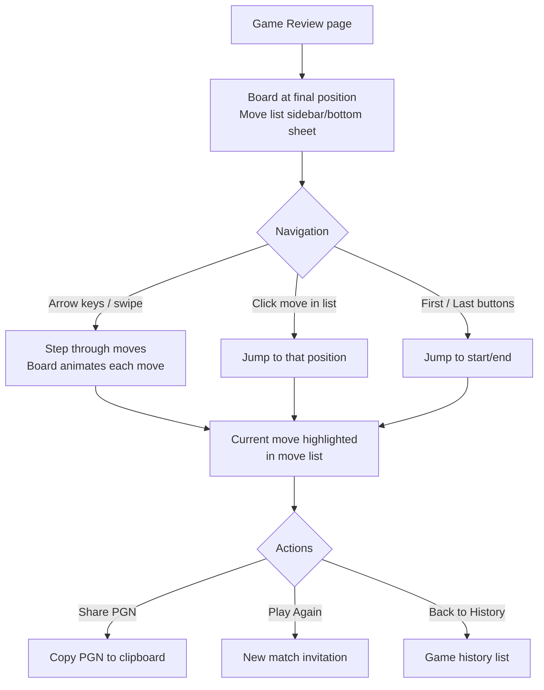

---
stepsCompleted:
  - step-01-init
  - step-02-discovery
  - step-03-core-experience
  - step-04-emotional-response
  - step-05-inspiration
  - step-06-design-system
  - step-07-defining-experience
  - step-08-visual-foundation
  - step-09-design-directions
  - step-10-user-journeys
  - step-11-component-strategy
  - step-12-ux-patterns
  - step-13-responsive-accessibility
  - step-14-complete
inputDocuments:
  - _bmad-output/planning-artifacts/prd.md
  - _bmad-output/planning-artifacts/architecture.md
  - _bmad-output/planning-artifacts/epics.md
  - _bmad-output/planning-artifacts/prd-validation-report-2026-02-27.md
  - _bmad-output/planning-artifacts/research/technical-firebase-supabase-baas-for-sveltekit-game-research-2026-02-25.md
  - docs/README.md
  - docs/Architecture.md
  - docs/ai-agent-guide/system-architecture.md
  - docs/ai-agent-guide/package-responsibilities.md
  - docs/ai-agent-guide/data-flow-patterns.md
  - docs/ai-agent-guide/api-contracts.md
  - docs/ai-agent-guide/deploy-session-mechanics.md
  - docs/ai-agent-guide/common-implementation-patterns.md
  - docs/ai-agent-guide/troubleshooting-guide.md
  - docs/architecture/CHESS_PROGRAMMING_STANDARDS.md
  - docs/performance/PERFORMANCE_OPTIMIZATION_PLAN.md
  - docs/LEARN_UX_INTERACTION_DESIGN.md
  - docs/LEARN_UX_CURRENT_INTEGRATION.md
  - docs/LEARN_REDESIGN_PLAN.md
  - docs/LEARN_SYSTEM_REDESIGN_PLAN.md
  - docs/LESSON_CODE_ARCHITECTURE.md
  - docs/LESSON_FLEXIBILITY_DESIGN.md
  - docs/LEARN_PROGRESSIVE_HINTS_DESIGN.md
  - docs/LEARN_PROGRESS_REPORT.md
  - docs/LEARN_PHASE_STATUS.md
  - docs/LEARN_HINTS_CONTEXT.md
  - docs/LEARN_TOOLTIP_COMPLETION_SUMMARY.md
  - docs/LEARN_TOOLTIP_IMPLEMENTATION.md
  - docs/PHASE_2_COMPLETE.md
  - docs/PHASE_2_CONTEXT.md
  - docs/PHASE_3_SUBJECT_1.md
---

# UX Design Specification cotulenh-monorepo

**Author:** Noy
**Date:** 2026-02-27

---

## Executive Summary

### Project Vision

CoTuLenh is the only Vietnamese military strategy board game of its kind — and it has no quality online platform. The one existing implementation (Board Game Arena) is buggy, slow, and abandoned. An active offline community deserves better.

This MVP transforms CoTuLenh from a local-play tool into a living online platform: authentication, user profiles, friends, match invitations, realtime gameplay, game history with PGN replay, and learn progress persistence. The vision is the definitive online home for CoTuLenh — modeled after Lichess's simplicity and speed, built on SvelteKit + Supabase.

The core UX promise: **Sign up, add a friend, play a game, review history — all in one session, under 5 minutes.**

### Target Users

**Minh — The BGA Veteran (Primary)**
Experienced player frustrated with BGA's lag and bugs. Mobile-heavy. Will compare everything to BGA. Speed and reliability are table stakes. If the first game feels better than BGA, he becomes an evangelist.

**Linh — The Curious Newcomer**
Strategy game fan discovering CoTuLenh through search. Starts in the learn system without signing up. The anonymous-to-authenticated transition must be invisible — zero friction, zero lost progress.

**Tuan — The Returning Learner**
Tried CoTuLenh before but had no one to play. Cross-device progress sync and invite link sharing bring him back. The invite link is both a growth mechanism and his personal on-ramp.

**Phong — Community Moderator**
Resolves disputes via Supabase dashboard and Discord. No custom moderation UI for MVP — manual processes with database access.

**Noy — Admin/Operator**
Solo developer and platform owner. Supabase dashboard is the admin tool. Feedback submissions and error logs are the primary operational interfaces.

### Key Design Challenges

1. **The 5-minute first game** — Every screen between landing page and first move is a potential drop-off. Sign up → find friend → create match → play must feel like one continuous action, not five separate tasks.

2. **Realtime gameplay on mobile** — A 12x9 board with 16 piece types, deploy sessions, air defense zones, and stacking mechanics on a phone screen. Players need precise touch moves, visible clocks, clear game status, and dispute notifications — all at 60fps without UI jank.

3. **Deploy session UX** — CoTuLenh's signature mechanic: multi-step piece deployment from stacks. A multi-turn interaction within a single turn. Must be intuitive for newcomers while staying fast for veterans. No board game platform has solved this well.

4. **Anonymous-to-authenticated seamlessness** — Users start learning without an account. On signup, localStorage progress migrates invisibly to the database. Zero friction, zero data loss, zero "please log in" walls.

5. **Dispute flow mid-game** — When an illegal move is detected, the game pauses for both players. High-tension moment requiring clear, fair-feeling UX. Both players must understand what happened and what their options are without panic.

### Design Opportunities

1. **First-impression speed advantage** — BGA is the only reference point. If the site loads fast, the board feels responsive, and the first game just works — players will spread the word. Speed is the feature.

2. **Learn-to-play pipeline** — The existing learn system is a natural on-ramp. A "Ready to play someone?" prompt after lessons creates a seamless path from learning to social gameplay.

3. **Invite links as growth engine** — A user shares a link, the recipient signs up through it and lands directly in a pending match. This is a viral loop built into the core mechanic. The invite landing page is the platform's front door for many new users.

4. **Vietnamese-first cultural authenticity** — CoTuLenh is Vietnamese. Bilingual experience (EN/VI), military chess identity, and community ownership create emotional attachment that BGA never achieved.

## Core User Experience

### Defining Experience

The core experience is the realtime game loop: tap a piece, see legal moves, tap the destination, opponent's board updates instantly. Every feature on the platform exists to get two people to that moment and keep them coming back. The move interaction must feel identical whether playing locally or online — any perceptible difference in responsiveness between local and networked play is a UX failure.

The secondary experience loop is the learn-to-play pipeline: explore lessons without an account, build skills, sign up when motivated, carry progress forward, find someone to play.

### Platform Strategy

- **Web-first:** SvelteKit SPA with SSR landing pages for SEO and fast initial load
- **Mobile browser is first-class:** Not an afterthought. The board, controls, and flows must work beautifully on phone screens (< 768px). Touch is the primary input on mobile; mouse/keyboard on desktop
- **No native app for MVP:** The web experience on mobile must stand on its own
- **No offline mode:** Realtime gameplay requires a connection. Learn system works offline via localStorage (existing behavior)
- **Bilingual (EN/VI):** Vietnamese is co-primary, not secondary. Language toggle is a prominent UI element

### Effortless Interactions

| Interaction                 | Effortless Standard                                                                                                                 |
| --------------------------- | ----------------------------------------------------------------------------------------------------------------------------------- |
| Sign up → first game        | Under 5 minutes end-to-end, feeling like one continuous action                                                                      |
| Making a move               | Tap piece → see legal moves → tap destination. Sub-500ms to opponent's board                                                        |
| Finding a friend            | Search by display name, send request — 2 taps maximum                                                                               |
| Invite link flow            | Click link → sign up → land in pending match. No dead ends, no extra navigation                                                     |
| Anonymous → auth transition | Learn progress migrates invisibly on signup. User sees their stars intact                                                           |
| Reconnection                | Refresh after disconnect → back in the game. No manual "rejoin" action                                                              |
| Deploy sessions             | Multi-step deployment guided by clear visual state — pieces glow, destinations highlight, progress indicator shows remaining pieces |

### Critical Success Moments

1. **First realtime move received** — The "it works" moment. Opponent's board updates instantly after a move. Zero perceptible delay. This validates the entire platform.
2. **First online deploy session** — The "this platform understands CoTuLenh" moment. Pieces split from stacks, move independently, state syncs correctly between players in realtime.
3. **Invite link landing** — The "growth loop works" moment. Recipient sees who invited them, signs up, and enters the pending match in one fluid flow.
4. **Post-game history** — The "my games matter here" moment. Game result appears in history. Players can replay move-by-move. PGN is preserved.
5. **Learn → Play bridge** — The "I'm ready" moment. After completing lessons, a natural prompt connects learning investment to social gameplay.

### Experience Principles

1. **Speed is the feature** — Sub-second everything: page loads, route transitions, move sync, search results. If users notice waiting, we've failed. Lichess proved speed alone beats feature-rich competitors.
2. **The board is the star** — Minimize chrome, maximize the game. On mobile, the board dominates the viewport. All UI serves the board, never competes with it.
3. **One obvious path forward** — Never make users choose when there's a clear next step. After signup → add a friend. After accepting invite → into the game. After game ends → result + play again. Reduce cognitive load at every junction.
4. **Invisible infrastructure** — Auth, data sync, realtime connections, progress migration — users never see the machinery. Skeleton screens over spinners. No "syncing" or "reconnecting" messages unless unavoidable.
5. **Vietnamese soul, universal usability** — The platform's identity is Vietnamese. Language toggle is prominent, cultural authenticity in tone and visuals. But interaction patterns are universally intuitive — any strategy game player navigates without instructions.

## Desired Emotional Response

### Primary Emotional Goals

**Competitive flow with community belonging.** The primary emotion is the focused, engaged state of strategic gameplay — where the world narrows to the board and the opponent's last move. Wrapping around that is a sense of belonging — "this is the home of CoTuLenh, and I'm part of it."

Secondary emotional layer: **Trust and confidence.** BGA trained these players to expect broken things. Every interaction that just works builds cumulative trust. Reliability is an emotional feature.

### Emotional Journey Mapping

| Stage               | Desired Feeling               | Design Trigger                                       |
| ------------------- | ----------------------------- | ---------------------------------------------------- |
| Discovery           | Curiosity + impressed         | Instant load, sharp board, "this feels serious"      |
| First signup        | Ease + momentum               | Quick form, no friction, immediate next step         |
| Adding first friend | Connection + anticipation     | Easy search, request sent, "soon we'll play"         |
| First game starts   | Excitement + focus            | Board appears, clock starts, it's real               |
| During gameplay     | Flow + strategic tension      | Instant move sync, immersive board, decisions matter |
| Deploy session      | Mastery + clarity             | "I understand this mechanic, it makes sense"         |
| Dispute triggered   | Calm concern, not panic       | Clear status, obvious options, neutral language      |
| Game ends           | Satisfaction or determination | Win: earned pride. Loss: "I see what went wrong"     |
| Post-game review    | Analytical engagement         | Move-by-move replay, understanding, planning         |
| Returning           | Comfort + anticipation        | "My stuff is here, my friends are here"              |

### Micro-Emotions

- **Confidence over confusion** — Every screen answers "what do I do next?" without instructions
- **Trust over skepticism** — Every interaction that just works builds cumulative reliability trust
- **Excitement over anxiety** — Tense moments (disputes, disconnections) feel manageable, not threatening
- **Belonging over isolation** — Friend presence, game history with opponent names, personal invite links

### Emotions to Prevent

- **Frustration** — Lag, bugs, unclear UI (the #1 BGA departure reason)
- **Abandonment** — Feeling no one maintains the platform (feedback channel + responsive admin counters this)
- **Overwhelm** — Too many options or complex mechanics without guidance (one obvious path forward)
- **Distrust** — Lost data, unreliable connections (invisible infrastructure principle)

### Design Implications

| Desired Emotion               | UX Design Approach                                                                              |
| ----------------------------- | ----------------------------------------------------------------------------------------------- |
| Flow during gameplay          | Board dominates viewport, minimal chrome, no interruptions except critical events               |
| Confidence in deploy sessions | Step counter ("piece 2 of 3"), visual highlighting of moved vs remaining pieces, undo available |
| Trust in platform             | Skeleton screens, persistent game state, instant move sync, complete game history               |
| Calm during disputes          | Neutral language ("Move dispute — both players notified"), clear options, no blame in copy      |
| Belonging to community        | Friend online indicators, personalized invites, Vietnamese-first language, platform identity    |
| Determination after loss      | "Review game" prominently placed, move-by-move replay, "Play again" as primary action           |

### Emotional Design Principles

1. **Reliability is an emotional feature** — Every interaction that works as expected deposits trust. Every bug withdraws it. For BGA refugees, the trust account starts near zero.
2. **Tension is welcome, anxiety is not** — A close game should feel thrilling. A network drop should feel manageable. Design the difference through clear status communication and obvious recovery paths.
3. **Celebrate without patronizing** — Game completion, first win, learn progress milestones deserve acknowledgment — but keep it understated and respectful. These are strategy players, not children.
4. **Presence creates belonging** — Showing who's online, who you've played, whose invite you're accepting. The platform should feel populated, not empty. Even with 20 users at launch.

## UX Pattern Analysis & Inspiration

### Inspiring Products Analysis

**Lichess (Primary Model)**
The gold standard for open-source game platforms. Speed is the identity — pages load in under 1 second, games start in 2 clicks. Board occupies 70%+ of viewport. Mobile experience matches desktop in quality. Account creation is optional and takes 30 seconds. Game review is clean: move-by-move replay with arrow key navigation and PGN export. The lesson: speed, simplicity, and reliability compound into an experience that feature-rich competitors can't match.

**Chess.com (Learn-to-Play Pipeline)**
Validates the progressive learning model: lessons → puzzles → games. Their most successful acquisition path mirrors Linh's journey. Social features (friends, direct challenge, clubs) demonstrate patterns CoTuLenh needs. The cautionary lesson: feature bloat, ads, and premium gates create friction that contradicts the "speed is the feature" principle.

**Board Game Arena (Anti-Inspiration)**
The direct competitor and proof of demand. Players tolerate BGA because no alternative exists — that tolerance ends at CoTuLenh launch. Failures to avoid: move lag (especially deploy sessions), 5+ step game setup, no reconnection handling, unresponsive mobile UI, unfixed bugs. What they proved: the market wants online CoTuLenh.

**Discord (Social Patterns)**
Friend lists with online/offline status (green dot UX). Invite links that "just work" — click, join, done. CoTuLenh's invite link flow should feel equally seamless: URL → context landing → signup → into the match.

### Transferable UX Patterns

**Navigation:**

- Flat top-level navigation (Lichess pattern): Play, Learn, Friends, Profile — no nested menus
- Board-centric layout: board front-and-center on every game page, controls are secondary

**Interaction:**

- One-click game entry: accept invite → playing (no intermediate screens)
- Learn-to-play bridge: suggest "play a real game" after lesson completion (Chess.com model)
- Invite link flow: URL → landing with inviter context → one-step signup → into pending match (Discord model)

**Visual:**

- Information density without clutter: move list, clock, player names, game status all visible without scrolling
- Mobile-first board layout: full-width board, controls below or in bottom sheet
- Speed over skeleton screens: aspire to Lichess-level load times where loading states are unnecessary

### Anti-Patterns to Avoid

| Anti-Pattern                      | Why It Hurts CoTuLenh                                                         |
| --------------------------------- | ----------------------------------------------------------------------------- |
| Multi-step game setup             | Every step is a drop-off. Invite → accept → play.                             |
| Modal stacking on game end        | Overwhelms instead of satisfying. Single result view with clear next actions. |
| Settings before first game        | Don't ask for preferences until after first game. Defaults must be good.      |
| Unresponsive mobile touch targets | Board pieces and controls must be touch-friendly at phone viewport sizes.     |
| "Reconnecting..." with no context | Show connection state clearly with recovery progress, not just a spinner.     |
| Feature gates or upsells          | CoTuLenh is free. Trust is the currency. No premium barriers.                 |

### Design Inspiration Strategy

**Adopt directly:**

- Lichess's board-centric layout and information hierarchy
- Lichess's flat navigation structure (4 top-level items max)
- Discord's invite link flow pattern
- Lichess's game review UX (arrow key navigation, move list, PGN)

**Adapt for CoTuLenh:**

- Chess.com's learn pipeline → bridge to online play with "play a real person" prompts
- Lichess's game start flow → adapt for friend-invitation model (no matchmaking in MVP)
- Discord's friend status → integrate into friends list with "challenge" action on online friends

**Reject explicitly:**

- BGA's multi-step game setup
- Chess.com's premium feature gates and notification spam
- Any pattern requiring more than 2 clicks from intent to action

## Design System Foundation

### Design System Choice

**Utility-First Themeable System: Tailwind CSS 4 + bits-ui + Custom Tokens**

The existing tech stack forms the design system foundation. No external design system (Material, Ant, Shadcn) is adopted — the overhead isn't justified for a solo developer with an established Tailwind + bits-ui setup that already powers the learn system.

### Rationale for Selection

- **Already in use** — Tailwind 4 and bits-ui are the existing stack. The learn system, board editor, and local play UI already follow these patterns. Adopting a different system would create inconsistency.
- **Solo developer fit** — Utility-first CSS eliminates context-switching between component APIs and custom styles. One mental model for all styling.
- **Performance** — Tailwind purges unused CSS. bits-ui is headless (minimal runtime JS). No heavy component library bundle.
- **Accessibility included** — bits-ui provides ARIA attributes, focus management, and keyboard navigation for all interactive primitives (dialogs, menus, dropdowns, form controls).
- **Visual identity freedom** — No design system imposes a "Material look" or "Ant look." CoTuLenh can develop its own visual personality.

### Implementation Approach

**Three UI Layers:**

1. **Board Layer** — `cotulenh-board` package. Custom rendering, piece sprites, drag/drop, visual feedback. Untouched by the design system. Accepts configuration (theme colors, piece sets) but owns all board-level rendering.

2. **Application UI Layer** — bits-ui primitives styled with Tailwind utilities. Handles: navigation, forms, buttons, dialogs, lists, toasts, dropdowns. Patterns established by learn system (SubjectCard, LessonPlayer, ProgressIndicator) extend to new features.

3. **Game Chrome Layer** — Custom Svelte components for game-specific UI built on Tailwind utilities: chess clocks, move list sidebar/bottom sheet, player info bar, game status indicators, deploy progress counter, dispute banner. Minimal by design — the board is the star.

### Customization Strategy

**Design Tokens (CSS Custom Properties via Tailwind 4):**

- Color palette: primary (CoTuLenh brand), semantic (success/warning/error/info), neutral scale
- Typography: system font stack for speed, consistent size scale
- Spacing: 4px base unit grid
- Breakpoints: Phone (< 768px), Tablet (768-1024px), Desktop (> 1024px) — matching PRD
- Border radius, shadows, transitions: consistent scale across components

**Component Patterns:**

- Forms: bits-ui form primitives + Tailwind styling. Consistent validation display.
- Buttons: primary (call to action), secondary, ghost (minimal). Touch targets minimum 44px on mobile.
- Cards: friend cards, game history cards, invitation cards. Consistent padding, border, hover states.
- Dialogs: bits-ui Dialog for confirmations, dispute flow, game setup. Proper focus trap and escape handling.
- Toasts: feedback messages, friend request notifications, game invitations. Non-blocking, auto-dismiss.

**Existing Pattern Library (from Learn System):**

- Target markers with pulsing animation
- Hover tooltips with smart positioning
- Progressive hint escalation visuals
- Star rating display
- Progress indicators (ring, bar)
- Bottom sheet pattern (mobile lesson controls)

These patterns extend naturally to the new features — game status indicators reuse the same animation approach as target markers, friend online status uses the same visual language as learn progress indicators.

## Defining Core Interaction

### Defining Experience

"Play a realtime game of CoTuLenh against your friend — and it just works." The moment a player makes a move and their opponent's board updates instantly, the platform has delivered its promise. The defining experience is board-to-board realtime gameplay that feels identical to sitting across from your opponent.

### User Mental Model

| Background           | Mental Model                     | Design Implication                                                                 |
| -------------------- | -------------------------------- | ---------------------------------------------------------------------------------- |
| BGA veterans         | "Online CoTuLenh is compromised" | Exceed low expectations immediately — speed and reliability create instant loyalty |
| Chess platform users | "Should feel like Lichess"       | Match established quality bar for move responsiveness, clocks, and game review     |
| Learn system users   | "Board should work the same"     | Board interaction must be identical across local play, learn mode, and online play |

The board interaction must be indistinguishable between local and online play. The `cotulenh-board` package provides this foundation — the only difference is what happens after the move callback fires.

### Success Criteria

| Criteria                   | Threshold                                                     |
| -------------------------- | ------------------------------------------------------------- |
| Move-to-opponent latency   | < 500ms on 4G — perceived as instant                          |
| Deploy session clarity     | First-time user understands deploy mode without instructions  |
| Reconnection transparency  | Refresh → back in game in < 3 seconds, no "rejoin" button     |
| Game completion confidence | Both players see same result, game in history within 1 second |
| Board feel parity          | Online move feels identical to local/learn mode move          |

### Novel UX Patterns

Four CoTuLenh-specific mechanics require novel UX design:

**Deploy Sessions (multi-turn within a turn):**

- Visual mode change signals deploy state (board border glow, status bar update)
- Progress counter: "Deploying: piece 2 of 4"
- Remaining pieces in stack highlighted
- Auto-advance to next piece after each placement
- Undo available for individual deploy steps
- Opponent sees pieces fan out in animated sequence

**Stay Captures (capture without moving):**

- Captured piece fades/disappears while attacker stays in place
- Distinct animation from normal captures
- Move list shows stay capture notation
- Stay option indicated when available during piece selection

**Air Defense Zones (invisible threat areas):**

- Zones reveal when air force piece is selected (overlay on threatened squares)
- Clear blocked-move feedback: "Air defense zone — can't fly here"
- Learn mode option: show all zones simultaneously for education

**Stacking (pieces combining on one square):**

- Layered piece visualization with count indicator
- Tap stack → fan-out showing contents
- Indicate which pieces can deploy vs. which must stay

### Experience Mechanics

**Initiation:** Accept invitation → game page loads → board with starting position → initial deploy session begins → clock starts after first deploy completes.

**The Move:** Tap piece → legal moves highlight → tap destination → piece animates → SAN broadcast to opponent → opponent's board validates and updates → clock switches → move list updates for both players.

**Deploy Session:** Tap stack → deploy mode activates → move each piece individually → progress counter tracks → all pieces placed → deploy complete → turn passes → opponent sees sequential animation.

**Feedback Loop:**

- Valid move: smooth slide animation + placement sound
- Opponent's move: slide animation on your board + distinct sound
- Invalid attempt: snap-back + contextual tooltip
- Clock pressure: display turns red under 30 seconds
- Disconnection: subtle "reconnecting" indicator, game state preserved

**Completion:** Game ends → result banner overlays board → primary actions: "Review Game" | "Play Again" → game persisted as PGN → appears in both players' history immediately.

## Visual Design Foundation

### Color System

**Philosophy:** CoTuLenh's palette draws from Vietnamese military identity — grounded earth tones with strategic, intentional accent colors. The board is the visual centerpiece; application chrome stays neutral to avoid competing.

**Theme Strategy: Dark + Light**
Both themes are essential — game platforms live in dark mode during play sessions but need a clean light mode for browsing, learning, and casual use. Dark mode is the default for gameplay screens; light mode for content-heavy screens (learn, profile). User can override globally.

**Semantic Color Tokens (CSS Custom Properties via Tailwind 4):**

| Token                      | Purpose                             | Light Mode      | Dark Mode                 |
| -------------------------- | ----------------------------------- | --------------- | ------------------------- |
| `--color-primary`          | Brand actions, links, active states | Deep teal       | Bright teal               |
| `--color-primary-hover`    | Interactive hover states            | Darker teal     | Lighter teal              |
| `--color-surface`          | Page background                     | White/warm gray | Dark charcoal             |
| `--color-surface-elevated` | Cards, dialogs, panels              | Light gray      | Slightly lighter charcoal |
| `--color-text`             | Primary text                        | Near-black      | Off-white                 |
| `--color-text-muted`       | Secondary text, labels              | Mid-gray        | Light gray                |
| `--color-border`           | Dividers, card borders              | Light gray      | Dark gray                 |
| `--color-success`          | Valid moves, confirmations, wins    | Green           | Green                     |
| `--color-warning`          | Clock pressure, cautions            | Amber           | Amber                     |
| `--color-error`            | Invalid moves, disputes, errors     | Red             | Red                       |
| `--color-info`             | Hints, tooltips, status             | Blue            | Blue                      |

**Game-Specific Colors:**

- `--color-move-highlight` — Legal move indicators (semi-transparent primary)
- `--color-last-move` — Last move highlight on board squares
- `--color-deploy-active` — Deploy session mode indicator (distinct from normal play)
- `--color-clock-critical` — Clock under 30 seconds (pulsing red)
- `--color-player-online` — Friend online indicator (green dot)

**Why teal as primary:** Teal is associated with strategy and focus — distinct from chess.com's green and lichess's brown/green. It reads well in both dark and light contexts, carries enough weight for a military strategy game without the aggression of red, and pairs naturally with earth-toned neutrals.

### Typography System

**Font Stack: System Fonts**

```
--font-sans: ui-sans-serif, system-ui, -apple-system, sans-serif;
--font-mono: ui-monospace, 'Cascadia Code', 'Fira Code', monospace;
```

System fonts load instantly (zero FOIT/FOUT), match user's OS conventions, and support Vietnamese diacritics natively. Speed is the feature — custom fonts add latency for marginal aesthetic benefit.

**Type Scale (based on 1rem = 16px):**

| Token         | Size            | Use                               |
| ------------- | --------------- | --------------------------------- |
| `--text-xs`   | 0.75rem (12px)  | Timestamps, fine print            |
| `--text-sm`   | 0.875rem (14px) | Labels, secondary info, move list |
| `--text-base` | 1rem (16px)     | Body text, form inputs            |
| `--text-lg`   | 1.125rem (18px) | Card titles, section labels       |
| `--text-xl`   | 1.25rem (20px)  | Page headings                     |
| `--text-2xl`  | 1.5rem (24px)   | Page titles                       |
| `--text-3xl`  | 1.875rem (30px) | Hero text (landing page only)     |

**Line Heights:**

- Tight (1.25): headings, game chrome, clocks
- Normal (1.5): body text, learn content
- Relaxed (1.75): long-form reading (rules, help)

**Font Weight Strategy:**

- Regular (400): body text
- Medium (500): labels, navigation, emphasis
- Semibold (600): headings, player names, game results
- Bold (700): reserved for critical UI — clock pressure, result banner

**Monospace Usage:**

- Move notation in move list (SAN)
- PGN display in game review
- Clock display (tabular figures prevent layout shift)

### Spacing & Layout Foundation

**Base Unit: 4px**
All spacing derives from multiples of 4px. This creates visual rhythm without rigidity.

| Token        | Value | Common Use                                 |
| ------------ | ----- | ------------------------------------------ |
| `--space-1`  | 4px   | Tight gaps (icon-to-text, inline elements) |
| `--space-2`  | 8px   | Default element padding, compact lists     |
| `--space-3`  | 12px  | Card internal padding, form field gaps     |
| `--space-4`  | 16px  | Section spacing, standard padding          |
| `--space-6`  | 24px  | Card external margins, content sections    |
| `--space-8`  | 32px  | Major section breaks                       |
| `--space-12` | 48px  | Page-level padding                         |
| `--space-16` | 64px  | Hero spacing, landing page sections        |

**Layout Principles:**

1. **Board-maximized layout** — On game pages, the board occupies maximum available space. Controls, clocks, and move list fill remaining space without scrolling. No fixed sidebars steal board real estate on mobile.

2. **Responsive breakpoints:**
   - Phone (< 768px): single-column, board full-width, controls in bottom sheet
   - Tablet (768–1024px): board with side panel for move list
   - Desktop (> 1024px): board centered with flanking panels (player info + controls left, move list right)

3. **Content density is contextual:**
   - Game screens: dense — every pixel serves the game
   - Learn screens: comfortable — room to read and absorb
   - Social screens (friends, history): standard — scannable lists with clear actions

**Grid System:**
No formal CSS grid columns. Flexbox and CSS Grid used contextually per layout need. The board dictates layout on game pages; standard content-width container (max-width: 1200px, centered) for non-game pages.

### Accessibility Considerations

**Contrast:**

- All text meets WCAG 2.1 AA minimum (4.5:1 for normal text, 3:1 for large text)
- Interactive elements meet 3:1 against adjacent colors
- Both dark and light themes independently verified for contrast compliance

**Touch Targets:**

- Minimum 44x44px for all interactive elements on mobile
- Board piece tap areas extend beyond visual piece boundaries
- Adequate spacing between adjacent tap targets (minimum 8px gap)

**Visual Indicators:**

- Never rely on color alone — combine with icons, text, or shape
- Move highlights use both color and shape (dots for moves, rings for captures)
- Deploy session state communicated through border treatment + text status, not just color
- Clock critical state: color change + text size increase + optional pulse animation

**Motion:**

- Respect `prefers-reduced-motion` — disable piece animations, pulse effects, transitions
- Essential state changes (move confirmation, deploy progress) use non-animated alternatives
- No auto-playing animations that can't be disabled

**Focus Management:**

- Visible focus rings on all keyboard-navigable elements
- Logical tab order through game controls
- bits-ui components provide built-in focus trap for dialogs and menus

## Design Direction Decision

### Design Directions Explored

Six visual directions were evaluated against CoTuLenh's established design principles:

1. **Lichess Pure** — Extreme board-centric minimalism, near-zero chrome
2. **Strategic Command** — Dark-first military tactical aesthetic, operational feel
3. **Vietnamese Warmth** — Warm neutrals, cultural identity, newcomer-friendly softness
4. **Modern App** — Bold cards, bottom navigation, social-app feel
5. **Scholarly** — Content-focused, reading-optimized, review-centric
6. **Dashboard Dense** — Maximum information density, power-user optimized

### Chosen Direction

**Direction 1 (Lichess Pure) as foundation, with selective borrowing from Directions 2 and 3.**

The primary visual language is extreme board-centric minimalism: the board dominates every game page, application chrome is reduced to essential controls, surfaces are clean and neutral, and teal appears only where interaction is needed.

**Selective borrowing:**

- **From Direction 2 (Strategic Command):** Dark mode as the default for game screens. Subtle tactical personality in game chrome elements — clocks, deploy counters, and status bars carry a slightly more commanding presence than pure Lichess minimalism.
- **From Direction 3 (Vietnamese Warmth):** Landing page and learn system use warmer tones to welcome newcomers. The learn-to-play pipeline benefits from a friendlier visual approach before transitioning to the focused gameplay aesthetic.

### Design Rationale

1. **Principle alignment** — "The board is the star" and "speed is the feature" both demand minimal chrome. Direction 1 maximizes board real estate and minimizes rendering overhead.
2. **Inspiration fidelity** — Lichess is the explicit design model. Deviating toward dashboard density or social-app patterns contradicts the established inspiration strategy.
3. **Solo developer pragmatism** — Fewer UI elements = less to design, build, test, and maintain. Visual minimalism is also operational minimalism.
4. **BGA competitive advantage** — BGA fails on reliability and speed, not on information density. CoTuLenh wins by being fast and clean, not by showing more data.
5. **Contextual warmth** — Pure minimalism across every screen risks feeling cold. Warmer tones for landing and learn create an inviting entry point before players graduate to the focused game environment.

### Implementation Approach

**Screen-by-screen visual strategy:**

| Screen Type               | Visual Treatment                                                                                  |
| ------------------------- | ------------------------------------------------------------------------------------------------- |
| Landing page              | Light mode, warm neutrals, welcoming. Board demo as hero element.                                 |
| Learn system              | Light mode default, comfortable spacing, friendly tone. Board integrated into lessons.            |
| Game page                 | Dark mode default, minimal chrome, board maximized. Teal accents for interactive elements only.   |
| Game review               | Dark mode, board + move list side-by-side. Clean analytical layout.                               |
| Friends list              | Light/dark follows user preference. Clean list, online indicators, "Challenge" as primary action. |
| Profile/History           | Light/dark follows preference. Card-based game history list. Stats displayed simply.              |
| Auth flows (signup/login) | Light mode, minimal fields, board silhouette in background.                                       |

**Component visual rules:**

- Buttons: solid fill for primary actions, ghost/outline for secondary. Never more than one primary button visible.
- Cards: subtle border on light, subtle elevation on dark. No heavy shadows.
- Navigation: top bar on desktop (logo + 4 items + user avatar), bottom sheet trigger on mobile.
- Dialogs: centered, dimmed backdrop, minimal content. One clear action.
- Toasts: bottom-right on desktop, bottom-center on mobile. Auto-dismiss after 4 seconds.

## User Journey Flows

### Journey 1: Minh — Sign Up to First Game

**Entry:** Facebook group link → landing page

```mermaid
flowchart TD
    A[Landing Page] --> B{Has account?}
    B -->|No| C[Sign Up Form<br>Email + password + display name]
    B -->|Yes| D[Sign In Form<br>Email + password]
    C --> E[Email verification sent]
    E --> F[Click verification link]
    F --> G[Authenticated — Home screen]
    D --> G
    G --> H[Friends tab — empty state<br>"Search for friends to play"]
    H --> I[Search by display name]
    I --> J[Results list — Send Request button]
    J --> K[Request sent — toast confirmation]
    K --> L{Friend accepts?}
    L -->|Yes| M[Friend appears in list<br>with online indicator]
    L -->|Waiting| N[Pending state in friends list]
    M --> O["Challenge" button on friend card]
    O --> P[Match invitation sent<br>Waiting for acceptance]
    P --> Q{Friend accepts match?}
    Q -->|Yes| R[Game page loads<br>Board + clocks + players]
    Q -->|Declined| S[Toast: "Invitation declined"<br>Back to friends list]
    R --> T[Initial deploy session begins]
    T --> U[Game in progress — realtime play]
    U --> V[Game ends — result banner]
    V --> W{Next action?}
    W -->|Review| X[Game review — move-by-move replay]
    W -->|Play again| O
    W -->|Home| G
```

**Critical UX decisions:**

- Sign up form: 3 fields maximum (email, password, display name). No CAPTCHA for MVP.
- Email verification happens in background — user can browse but can't create matches until verified.
- Empty friends list shows clear call-to-action, not a blank page.
- Friend search is instant (debounced, server-side) — results appear as user types.
- "Challenge" button is primary action on online friend cards; disabled/hidden for offline friends.
- Match invitation has a 5-minute expiry with countdown visible to both players.

**Optimization:** Total tap count from landing to first move: Landing → Sign Up (1) → Fill form + submit (1) → Verify email (external) → Search friend (1) → Send request (1) → Challenge (1) → **5 taps + form entry + email verification.** Post-signup return: Home → Challenge friend → **2 taps.**

---

### Journey 2: Linh — Learn to Play Pipeline

**Entry:** Web search → landing page → learn section

```mermaid
flowchart TD
    A[Landing Page] --> B[Learn section — no auth required]
    B --> C[Subject selection<br>9 progressive subjects]
    C --> D[Lesson player<br>Interactive board + instructions]
    D --> E{Lesson complete?}
    E -->|Yes| F[Star rating + next lesson]
    E -->|Retry| D
    F --> G{Completed 3+ lessons?}
    G -->|No| C
    G -->|Yes| H[Prompt: "Ready to play someone?<br>Sign up to challenge friends"]
    H --> I{User signs up?}
    I -->|Yes| J[Sign Up Form]
    I -->|Not yet| C
    J --> K[Account created]
    K --> L[Progress migration<br>localStorage → database<br>Invisible to user]
    L --> M[Home screen<br>Learn stars preserved<br>"Add a friend to play!" prompt]
    M --> N[Friends flow — same as Journey 1]
    N --> O[First online game]
```

**Critical UX decisions:**

- Learn system is fully functional without auth — zero barriers to entry.
- "Ready to play someone?" prompt appears contextually after lesson completion, not as a persistent banner.
- Progress migration is invisible — user sees their stars intact after signup. No "importing progress" state.
- If migration fails silently, local progress is preserved and retry happens on next page load.
- The prompt adapts: after signup it changes to "Add a friend to play!" with friend search inline.

**Edge case — returning without account:**

- localStorage progress persists across sessions on same device/browser.
- If user clears browser data, progress is lost (acceptable for anonymous users — this motivates signup).

---

### Journey 3: Tuan — Invite Link Growth Loop

**Entry:** Shared invite link (e.g., cotulenh.com/invite/abc123)

```mermaid
flowchart TD
    A[Invite link clicked] --> B[Invite landing page<br>"Tuan invited you to play CoTuLenh"]
    B --> C{Has account?}
    C -->|No| D[Sign Up form<br>Pre-filled context: "Join to play with Tuan"]
    C -->|Yes| E[Sign In]
    D --> F[Account created<br>Auto-friend with inviter]
    E --> G{Already friends?}
    G -->|Yes| H[Direct to pending match]
    G -->|No| F
    F --> H[Pending match screen<br>"Waiting for Tuan to start a game"<br>OR match auto-created]
    H --> I{Match starts?}
    I -->|Tuan creates match| J[Game page loads]
    I -->|Tuan offline| K[Friends list<br>"Tuan is offline — you'll be notified<br>when they're available"]
    J --> L[First game together]
```

**Critical UX decisions:**

- Invite landing page shows inviter's display name — personalized, not generic.
- Sign up through invite link auto-adds the inviter as a friend — skips the friend request flow entirely.
- If inviter is online when recipient completes signup, prompt inviter to create a match immediately.
- If inviter is offline, recipient lands on friends list with clear status — no dead end.
- Invite links don't expire (for MVP) but are one-use per recipient account.

**The growth mechanic:** Every invite link is a potential new user acquisition. The landing page is optimized as a conversion funnel — board visual in background, inviter context prominent, minimal form fields.

---

### Journey 4: Core Gameplay — Realtime Match Flow

**Entry:** Match accepted → game page

```mermaid
flowchart TD
    A[Game page loads] --> B[Board renders<br>Starting position]
    B --> C[Initial deploy session<br>Both players deploy pieces]
    C --> D[Deploy complete<br>Clock starts]
    D --> E{Your turn?}
    E -->|Yes| F[Tap piece → legal moves shown]
    E -->|No| G[Opponent thinking<br>Their clock running]
    F --> H{Move type?}
    H -->|Normal move| I[Tap destination → piece slides]
    H -->|Deploy session| J[Deploy mode activates<br>Progress counter appears]
    H -->|Stay capture| K[Tap capture target<br>Enemy fades, piece stays]
    I --> L[Move broadcast to opponent<br>Clock switches]
    J --> M[Move pieces individually<br>"Deploying: piece 2 of 4"]
    M --> N{All pieces placed?}
    N -->|No| M
    N -->|Yes| L
    K --> L
    L --> G
    G --> O[Opponent's move animates<br>on your board]
    O --> E

    E --> P{Game end condition?}
    P -->|Checkmate/Resign/Timeout| Q[Result banner<br>Win / Loss / Draw]
    P -->|Disconnect| R[Reconnection flow]
    R --> S{Reconnected < 60s?}
    S -->|Yes| E
    S -->|No| T[Game forfeited<br>by disconnected player]

    Q --> U{Next action?}
    U -->|Review Game| V[Game review page<br>Move-by-move + PGN]
    U -->|Play Again| W[New match invitation<br>to same opponent]
    U -->|Home| X[Home screen]
```

**Critical UX decisions:**

- Initial deploy session happens before clocks start — no time pressure on setup.
- During deploy mode: board border glows, status bar shows "Deploy Mode," progress counter tracks pieces.
- Opponent's moves animate on your board with distinct sound (different from your own move sound).
- Clock display turns red + increases in size below 30 seconds.
- Disconnection shows subtle "Reconnecting..." with progress indicator — not a blocking modal.
- 60-second reconnection window before forfeit (configurable server-side).
- Result banner overlays board bottom — board stays visible for immediate context.

**Dispute sub-flow:**

```mermaid
flowchart TD
    A[Move validation fails<br>on opponent's client] --> B[Dispute raised automatically]
    B --> C[Both players see:<br>"Move dispute — game paused"]
    C --> D[Options: Accept move / Challenge]
    D -->|Accept| E[Game continues]
    D -->|Challenge| F[Dispute recorded<br>Game ends — pending review]
    F --> G[Both players notified<br>"Game paused for review"]
```

---

### Journey 5: Post-Game Review

**Entry:** "Review Game" from result banner OR game history list



**Critical UX decisions:**

- Desktop: board left, move list right. Mobile: board top, move list in scrollable bottom sheet.
- Arrow left/right step through moves. On mobile, swipe left/right on the board.
- Move list uses SAN notation in monospace font. Current move highlighted with primary color.
- PGN export is a "Copy" button — clipboard API. No file download for MVP.

---

### Journey Patterns

**Reusable patterns across all journeys:**

**Navigation patterns:**

- **One obvious next action** — Every screen has a single primary action button. Secondary actions are visually de-emphasized.
- **Contextual back navigation** — Browser back always works. No broken history states. SvelteKit client-side routing preserves this.
- **Empty state = call to action** — No blank screens. Empty friends list → "Search for friends." Empty game history → "Play your first game."

**Feedback patterns:**

- **Toast for confirmations** — Friend request sent, match invitation sent, PGN copied. Non-blocking, auto-dismiss 4s.
- **Inline for errors** — Form validation, search no results. Appears next to the relevant element.
- **Banner for game state** — Disputes, disconnection, game results. Overlays board area, requires action to dismiss.

**Transition patterns:**

- **Invisible data sync** — Progress migration, game state persistence, friend status updates. No "syncing" UI.
- **Optimistic UI** — Move appears immediately on your board before server confirmation. Rollback only if validation fails.
- **Graceful degradation** — If realtime connection drops, fall back to polling. If polling fails, show reconnection state.

### Flow Optimization Principles

1. **Tap count budget** — Every journey has a maximum tap count from entry to value. Sign up to first game: 5 taps + form. Return to game: 2 taps. Review a game: 1 tap from history.
2. **Zero dead ends** — Every screen offers a forward path. No "nothing here" states without a clear next action.
3. **Progressive commitment** — Don't ask for information before it's needed. Display name at signup (needed for friend search), preferences after first game, not before.
4. **Failure recovery built in** — Every error state includes a recovery action. Disconnect → auto-reconnect. Validation fail → inline message + what to fix. Invite expired → "Send new invite."

## Component Strategy

### Design System Components

**bits-ui primitives (available, styled with Tailwind):**

| Component     | CoTuLenh Usage                                                     |
| ------------- | ------------------------------------------------------------------ |
| Dialog        | Match confirmation, resign confirmation, dispute options, settings |
| Alert Dialog  | Destructive actions (unfriend, abandon game)                       |
| Dropdown Menu | User menu (profile, settings, sign out), game options              |
| Popover       | Quick friend info, move annotations                                |
| Tooltip       | Board piece info, button labels, status explanations               |
| Tabs          | Profile sections (games, friends, stats), learn subjects           |
| Toggle        | Theme switcher (dark/light), sound on/off                          |
| Avatar        | Player photos/initials in friend cards, game chrome, history       |
| Switch        | Settings toggles (notifications, sound, animations)                |
| Separator     | Section dividers in lists and panels                               |
| Label         | Form field labels throughout auth and settings                     |

**Tailwind utility patterns (no component library needed):**

- Buttons (primary, secondary, ghost) — utility classes, not components
- Cards — consistent padding/border/radius pattern
- Form inputs — styled native inputs with validation states
- Lists — friend list, game history, search results
- Toast container — positioned wrapper with enter/exit transitions

### Custom Components

**Game Chrome Layer — unique to CoTuLenh:**

**ChessClock**

- **Purpose:** Display dual countdown timers showing each player's remaining time
- **Anatomy:** Two timer displays (top: opponent, bottom: you), active indicator on current player's clock
- **States:** Running (active player highlighted), paused (deploy session / dispute), critical (< 30s, red + pulse), expired (timeout)
- **Variants:** Compact (mobile — inline with player name), expanded (desktop — larger digits in side panel)
- **Accessibility:** `aria-live="polite"` for time announcements at critical thresholds, `role="timer"`
- **Behavior:** Monospace tabular figures prevent layout shift. Switches on move confirmation. Pauses during deploy sessions.

**MoveList**

- **Purpose:** Scrollable list of game moves in SAN notation, enabling move-by-move navigation
- **Anatomy:** Numbered rows (1. e4 e5, 2. Nf3 ...), current move highlighted, auto-scroll to latest
- **States:** Live game (auto-appending), review mode (clickable for navigation), empty (game start)
- **Variants:** Sidebar (desktop, vertical scroll), bottom sheet (mobile, horizontal scroll option)
- **Accessibility:** Keyboard navigable (arrow keys step through moves), `aria-current` on active move
- **Behavior:** Click/tap jumps board to that position. In review mode, arrow keys step forward/back.

**DeployProgressCounter**

- **Purpose:** Show deploy session progress — which piece is being deployed, how many remain
- **Anatomy:** Mode label ("Deploy Mode"), progress indicator ("Piece 2 of 4"), piece icons for remaining
- **States:** Active (deploying), waiting (opponent's deploy), complete (all pieces placed), undo available
- **Accessibility:** `aria-live="assertive"` announces deploy progress, clear text alternative to visual state
- **Behavior:** Appears when deploy mode activates. Auto-advances to next piece after placement. Undo button reverts last deploy step.

**GameResultBanner**

- **Purpose:** Display game outcome with next actions
- **Anatomy:** Result text (Win/Loss/Draw + method), primary action ("Review Game"), secondary action ("Play Again"), dismiss
- **States:** Win (subtle celebration tone), loss (neutral), draw (neutral), forfeit (contextual explanation)
- **Accessibility:** `role="alertdialog"`, focus trapped to actions, `aria-label` describes result
- **Behavior:** Overlays bottom portion of board. Board stays visible above. Auto-focuses primary action.

**PlayerInfoBar**

- **Purpose:** Display player identity and status alongside the board
- **Anatomy:** Avatar, display name, online indicator (dot), clock display, captured pieces
- **States:** Your turn (name highlighted), opponent's turn (clock active), disconnected (gray indicator)
- **Variants:** Top bar (opponent) + bottom bar (you) — mirrored layout
- **Accessibility:** `aria-label` with full player status description

**DisputeBanner**

- **Purpose:** Notify both players of a move dispute and present resolution options
- **Anatomy:** Status icon, message ("Move dispute — game paused"), action buttons (Accept / Challenge)
- **States:** Active dispute (awaiting action), resolved (fading out), under review (waiting for moderator)
- **Accessibility:** `role="alert"`, focus moved to banner on appearance, clear action labels

**ReconnectionIndicator**

- **Purpose:** Subtle indicator of connection state during gameplay
- **Anatomy:** Small status bar or icon with text ("Reconnecting..." / "Connected")
- **States:** Connected (hidden), reconnecting (visible, animated dots), failed (visible, "Connection lost")
- **Accessibility:** `aria-live="polite"` announces state changes
- **Behavior:** Appears only when connection is interrupted. Non-blocking — game board stays interactive for move preparation.

**Application UI Layer — social and navigation:**

**FriendCard**

- **Purpose:** Display friend info with primary action in friends list
- **Anatomy:** Avatar, display name, online status indicator, primary action button
- **States:** Online ("Challenge" button primary), offline (status text, challenge disabled), pending request (accept/decline)
- **Variants:** List item (friends list), compact (game invitation selector)
- **Accessibility:** Card is focusable, action button keyboard accessible, status announced

**GameHistoryCard**

- **Purpose:** Display game summary in history list
- **Anatomy:** Opponent avatar + name, result badge (W/L/D), date, move count, "Review" action
- **States:** Default, hover (subtle highlight), reviewed (subtle indicator)
- **Behavior:** Click anywhere on card opens game review. Result badge color-coded (green/red/gray).

**MatchInvitationToast**

- **Purpose:** Real-time notification of incoming match challenge
- **Anatomy:** Challenger name + avatar, accept/decline buttons, expiry countdown
- **States:** Active (countdown running), expired (auto-dismiss), accepted (transition to game), declined (dismiss)
- **Accessibility:** `role="alertdialog"`, focus moved to toast, keyboard accessible accept/decline
- **Behavior:** Appears over current page. 5-minute expiry. Does not block page interaction.

**InviteLandingHero**

- **Purpose:** Personalized landing for invite link recipients
- **Anatomy:** Board visual background, inviter's display name, welcome message, sign up / sign in buttons
- **States:** Valid invite (personalized), expired invite (generic landing with signup)
- **Behavior:** Single-purpose conversion page. Minimal navigation — focus entirely on signup action.

**EmptyState**

- **Purpose:** Reusable pattern for empty lists with call-to-action
- **Anatomy:** Illustration/icon, descriptive text, primary action button
- **Variants:** Friends ("Search for friends to play"), history ("Play your first game"), search ("No results")
- **Behavior:** Always provides a forward path. Never a blank screen.

**LanguageToggle**

- **Purpose:** Switch between English and Vietnamese
- **Anatomy:** Two-option toggle (EN / VI), prominent placement in navigation
- **States:** Active language highlighted
- **Accessibility:** `aria-label="Language"`, keyboard toggle with space/enter
- **Behavior:** Instant switch, no page reload (SvelteKit i18n). Persisted to localStorage (anonymous) or user profile (authenticated).

### Component Implementation Strategy

**Build approach:** All custom components are Svelte 5 components using runes (`$state`, `$derived`, `$effect`). Styled with Tailwind utility classes. Interactive primitives (focus trap, keyboard handling) use bits-ui internals where applicable.

**Shared patterns:**

- All components consume design tokens via CSS custom properties
- Dark/light theme support via `class` strategy (Tailwind dark mode)
- All interactive components meet 44px minimum touch target on mobile
- All stateful components use `aria-live` regions for screen reader announcements

**Testing strategy:**

- Components tested in Storybook-like isolation (Svelte component tests)
- Accessibility tested with axe-core automated scans
- Mobile touch targets verified at 375px viewport minimum

### Implementation Roadmap

**Phase 1 — Core Game (Epic 1-2: Auth + Friends):**

- EmptyState, FriendCard, LanguageToggle
- Auth forms (Tailwind-styled native inputs + bits-ui Dialog for confirmations)
- Navigation bar with bits-ui Dropdown for user menu

**Phase 2 — Realtime Gameplay (Epic 3: Online Play):**

- ChessClock, MoveList, PlayerInfoBar, DeployProgressCounter
- GameResultBanner, DisputeBanner, ReconnectionIndicator
- MatchInvitationToast

**Phase 3 — Growth & Review (Epic 4-5: History + Invites):**

- GameHistoryCard, InviteLandingHero
- MoveList review mode (reuses live game component with navigation controls)

Components are ordered by epic dependency — each phase delivers a complete user journey before moving to the next.

## UX Consistency Patterns

### Button Hierarchy

**Three tiers, strictly enforced:**

| Tier        | Style                                    | When to Use                             | Examples                                              |
| ----------- | ---------------------------------------- | --------------------------------------- | ----------------------------------------------------- |
| Primary     | Solid fill, teal background              | The ONE most important action on screen | "Sign Up," "Challenge," "Accept Match," "Review Game" |
| Secondary   | Outline/ghost, teal text                 | Supporting actions alongside primary    | "Play Again," "Decline," "Copy PGN"                   |
| Destructive | Outline, red text (solid red on confirm) | Irreversible actions                    | "Resign," "Unfriend," "Abandon Game"                  |

**Rules:**

- Maximum ONE primary button visible per screen/dialog at any time
- Destructive actions always require confirmation via Alert Dialog
- All buttons: minimum height 40px desktop, 44px mobile. Horizontal padding 16px minimum.
- Icon-only buttons (settings gear, close X) use ghost style with tooltip on hover
- Loading state: button text replaced with spinner, button disabled. Never show both text and spinner.

### Feedback Patterns

**Four feedback channels, each with a specific role:**

**Toasts (non-blocking confirmations):**

- Position: bottom-right desktop, bottom-center mobile
- Duration: 4 seconds auto-dismiss, dismissable on click
- Use for: friend request sent, invitation sent, PGN copied, settings saved
- Style: subtle background, icon + short text. No actions on toasts.
- Max 1 toast visible at a time — new toast replaces existing

**Inline messages (contextual feedback):**

- Position: immediately below the relevant element
- Use for: form validation errors, search no results, field requirements
- Style: small text, color-coded (red for error, amber for warning)
- Appear on blur or submit, clear on input focus
- Always provide what to fix, not just what's wrong: "Display name must be 3-30 characters" not "Invalid name"

**Banners (game state changes):**

- Position: overlays board area (bottom portion) or top of non-game pages
- Use for: game result, dispute notification, connection state, system announcements
- Style: full-width, prominent, requires user action to dismiss
- Game banners are contextual to game page only — never persist across navigation

**Skeleton screens (loading states):**

- Use for: initial page load, friend list, game history, board setup
- Style: gray placeholder shapes matching expected content layout
- Never show spinners for page-level loading — always skeleton shapes
- Spinners reserved for: button loading states, move validation (< 500ms, rarely visible)

### Form Patterns

**Auth forms (sign up, sign in):**

- Maximum 3 fields on sign up: email, password, display name
- Maximum 2 fields on sign in: email, password
- Validation: real-time on blur, summary on submit
- Password requirements shown proactively (not after failure)
- Submit button disabled until all required fields have content (not necessarily valid)
- Error state: field border turns red, inline message below

**Search (friend search):**

- Debounced input (300ms delay before server query)
- Results appear in dropdown below input — no separate results page
- Empty state: "No users found" with suggestion to check spelling
- Minimum 2 characters before search triggers

**Settings:**

- Immediate save on change (toggle, select) — no "Save" button for individual settings
- Toast confirmation: "Setting saved"
- Group related settings with section headers

### Navigation Patterns

**Top navigation bar (desktop):**

- Fixed position, always visible
- Left: logo (links to home). Center/right: Play, Learn, Friends, Profile. Far right: user avatar dropdown.
- Active route highlighted with underline or background tint
- Maximum 4 top-level items — no nested menus in main nav

**Mobile navigation:**

- Hamburger menu icon in top-right (opens side drawer or full-screen overlay)
- Same 4 items as desktop, vertically stacked
- Game page: navigation hidden entirely — board maximized. Back button only.
- Bottom sheet pattern for contextual controls (move list, game actions)

**Page transitions:**

- SvelteKit client-side navigation — instant route changes, no full page reload
- No transition animations between pages (speed over polish)
- Browser back/forward always works — no broken history states
- Deep links work for all public pages (landing, learn, invite)

**Breadcrumbs:** Not used. Flat navigation structure means breadcrumbs add clutter without value. Back button and top nav are sufficient.

### Loading & Empty States

**Loading hierarchy:**

1. Instant (< 100ms): no loading state shown. Target for all client-side interactions.
2. Brief (100-500ms): skeleton screen. Target for initial page loads.
3. Noticeable (500ms-2s): skeleton screen with subtle pulse animation. Acceptable for first-load data fetches.
4. Long (> 2s): skeleton + text indicator ("Loading game history..."). Should be rare — investigate if seen.

**Empty states — always a call to action:**

| Screen          | Empty Message             | Action                                          |
| --------------- | ------------------------- | ----------------------------------------------- |
| Friends list    | "No friends yet"          | "Search for players" (with search input inline) |
| Game history    | "No games played"         | "Challenge a friend to your first game"         |
| Search results  | "No players found"        | "Check the spelling or try a different name"    |
| Pending invites | "No pending invitations"  | "Challenge a friend from your friends list"     |
| Learn progress  | "Start learning CoTuLenh" | "Begin with Piece Movement" (first subject)     |

### Modal & Overlay Patterns

**Dialog usage rules:**

- Confirmation dialogs: resign, unfriend, abandon game. Two clear actions (confirm + cancel).
- Information dialogs: dispute details, game rules reference. Single dismiss action.
- Never stack dialogs — one dialog at a time.
- Always closeable via Escape key and backdrop click (except destructive confirmations).
- Focus trapped inside dialog. Focus returns to trigger element on close.

**Bottom sheet (mobile):**

- Used for: move list during game, game actions menu, friend actions
- Draggable handle at top — swipe down to dismiss
- Partial-height default (40% of viewport), expandable to full
- Content scrolls within sheet — page behind is non-interactive

**Overlay (game result, dispute):**

- Semi-transparent backdrop over board
- Content centered vertically. Board partially visible behind.
- Cannot be dismissed by backdrop click — requires explicit action choice

### Realtime & Connection Patterns

**Optimistic updates:**

- Your move: piece animates immediately on your board before server roundtrip
- If server rejects (validation fail): piece snaps back, inline error shown
- Friend request: appears in pending immediately, confirmed on server response

**Presence indicators:**

- Green dot: online (active in last 5 minutes)
- No dot: offline
- No "away" or "busy" states for MVP — keep it simple

**Connection state:**

- Connected: no indicator (invisible infrastructure principle)
- Reconnecting: subtle bar at top of game page with animated dots. Non-blocking.
- Failed (> 60s): "Connection lost — trying to reconnect..." with manual retry button
- Reconnected: brief "Connected" toast, auto-dismiss 2s

## Responsive Design & Accessibility

### Responsive Strategy

**Mobile-first approach.** CoTuLenh's primary user (Minh) plays on his phone. Mobile is not an adaptation of desktop — it's the primary design target. Desktop gets more space, not a different experience.

**Phone (< 768px) — Primary target:**

- Board: full viewport width, square aspect ratio maintained. Board height = viewport width.
- Game chrome: player names + clocks in thin bars above/below board. Move list and actions in bottom sheet.
- Navigation: hamburger menu (top-right). Hidden entirely during active game.
- Content pages (learn, friends, history): single-column, full-width cards.
- Touch interactions: tap-to-move (tap piece, tap destination). No drag-and-drop required on mobile (optional enhancement).

**Tablet (768–1024px) — Enhanced mobile:**

- Board: centered, sized to leave room for side panel (move list).
- Game chrome: player bars above/below board. Move list in right panel.
- Navigation: full top bar (same as desktop).
- Content pages: two-column layout where natural (friend list + friend detail).

**Desktop (> 1024px) — Full experience:**

- Board: centered, max-height constrained to viewport. Flanked by panels.
- Game chrome: left panel (player info, captured pieces), right panel (move list, game controls).
- Navigation: fixed top bar. Logo + 4 nav items + user dropdown.
- Content pages: max-width 1200px container, centered. Multi-column where appropriate.
- Mouse interactions: drag-and-drop for moves (in addition to click-click). Keyboard shortcuts for game review.

### Breakpoint Strategy

**Three breakpoints matching Tailwind 4 defaults:**

| Breakpoint       | Width    | Layout                                       | Target Devices         |
| ---------------- | -------- | -------------------------------------------- | ---------------------- |
| Default (mobile) | < 768px  | Single column, board full-width              | Phones (375px–767px)   |
| `md`             | ≥ 768px  | Board + side panel                           | Tablets, small laptops |
| `lg`             | ≥ 1024px | Board + flanking panels, max-width container | Laptops, desktops      |

**No XL breakpoint.** Content maxes out at 1200px container width. Extra space beyond that is empty margins — the board doesn't benefit from being larger than ~600px.

**Critical responsive behaviors:**

| Component      | Phone                    | Tablet                    | Desktop               |
| -------------- | ------------------------ | ------------------------- | --------------------- |
| Board          | 100% width               | ~60% width                | ~50% width, max 600px |
| Move list      | Bottom sheet             | Right panel               | Right panel           |
| Player info    | Thin bars (name + clock) | Bars with captured pieces | Full side panel       |
| Navigation     | Hamburger menu           | Top bar                   | Top bar               |
| Deploy counter | Overlay on board         | Below board               | In left panel         |
| Game result    | Bottom overlay           | Bottom overlay            | Centered overlay      |
| Friend list    | Full-width cards         | Two-column grid           | Three-column grid     |
| Game history   | Full-width cards         | Two-column grid           | Table view option     |

### Accessibility Strategy

**Compliance target: WCAG 2.1 AA**

AA is the industry standard and achievable for a solo developer without an accessibility specialist. AAA is aspirational for text contrast but not targeted for all criteria.

**CoTuLenh-specific accessibility challenges:**

1. **Board interaction** — The 12x9 grid with 16 piece types must be navigable by keyboard and announced by screen readers.
   - Solution: each square is a focusable element with `aria-label` describing contents ("B4: Red Infantry")
   - Arrow keys navigate between squares. Enter/Space selects piece or confirms move.
   - Legal moves announced: "5 legal moves available" on piece selection.

2. **Realtime game state** — Move updates, clock changes, and game events must be announced without overwhelming screen reader users.
   - Solution: `aria-live="polite"` region for opponent moves and game events. Announcements are concise: "Opponent moved Infantry to C5."
   - Clock announcements only at critical thresholds (1 minute, 30 seconds, 10 seconds).

3. **Deploy sessions** — Multi-step interaction must be navigable without visual cues alone.
   - Solution: deploy progress announced via `aria-live`. Each step clearly narrated: "Deploy piece 2 of 4. Select destination."

4. **Board themes and colors** — Piece identification cannot rely solely on color.
   - Solution: pieces identified by shape/icon, not just color. Red vs Blue teams use distinct piece silhouettes in addition to color.

**Accessibility checklist for all components:**

- Semantic HTML elements (button, nav, main, article, section, heading hierarchy)
- All interactive elements keyboard focusable and operable
- Visible focus indicators (2px outline, high contrast)
- All images and icons have alt text or `aria-label`
- Form inputs associated with labels
- Error messages programmatically associated with fields (`aria-describedby`)
- No content conveyed by color alone
- Text resizable to 200% without layout breakage
- `prefers-reduced-motion` respected for all animations

### Testing Strategy

**Automated testing (every build):**

- axe-core integration in component tests — catches ~30% of accessibility issues automatically
- Lighthouse accessibility audit in CI — flag regressions
- HTML validation — semantic structure errors

**Manual testing (per feature):**

- Keyboard-only navigation through complete user journeys
- Screen reader testing with NVDA (Windows) and VoiceOver (macOS/iOS) for critical flows
- Mobile testing on actual devices: iPhone SE (small screen), iPhone 14 (standard), Android mid-range
- Browser testing: Chrome, Firefox, Safari (iOS/macOS), Samsung Internet

**Responsive testing (per feature):**

- Chrome DevTools device emulation for layout verification at all breakpoints
- Real device testing for touch interactions (board moves, bottom sheets, swipe gestures)
- Network throttling (3G, 4G) for performance under constrained conditions

**What we skip for MVP:**

- JAWS testing (Windows-only, enterprise screen reader)
- Color blindness simulation testing (design tokens handle this at the system level)
- Formal accessibility audit by external specialist

### Implementation Guidelines

**Responsive development rules:**

- Write mobile styles first, use `md:` and `lg:` Tailwind prefixes to add tablet/desktop styles
- Use `rem` for typography and spacing, `%` and `vw/vh` for layout dimensions
- Board sizing: CSS `aspect-ratio: 4/3` (12x9 grid) with `max-width` and `max-height` constraints
- Test every component at 375px width minimum (iPhone SE viewport)
- No horizontal scrolling on any page at any breakpoint

**Accessibility development rules:**

- Every custom component gets a keyboard interaction spec before implementation
- Every dynamic content update gets an `aria-live` region classification (polite vs assertive)
- Every form field gets a visible label — no placeholder-only labels
- Every page gets a skip link ("Skip to main content" / "Skip to board")
- Heading hierarchy: one `h1` per page, no skipped levels
- Focus order matches visual order — no `tabindex` values > 0

**Board-specific guidelines:**

- Board renders as a grid of `button` elements (not `div` with click handlers)
- Each cell announces: piece type, team, position (e.g., "Red General at E1")
- Selected piece state: `aria-pressed="true"`, legal moves announced
- Move confirmation: "Infantry moved from B4 to B5" announced in live region
