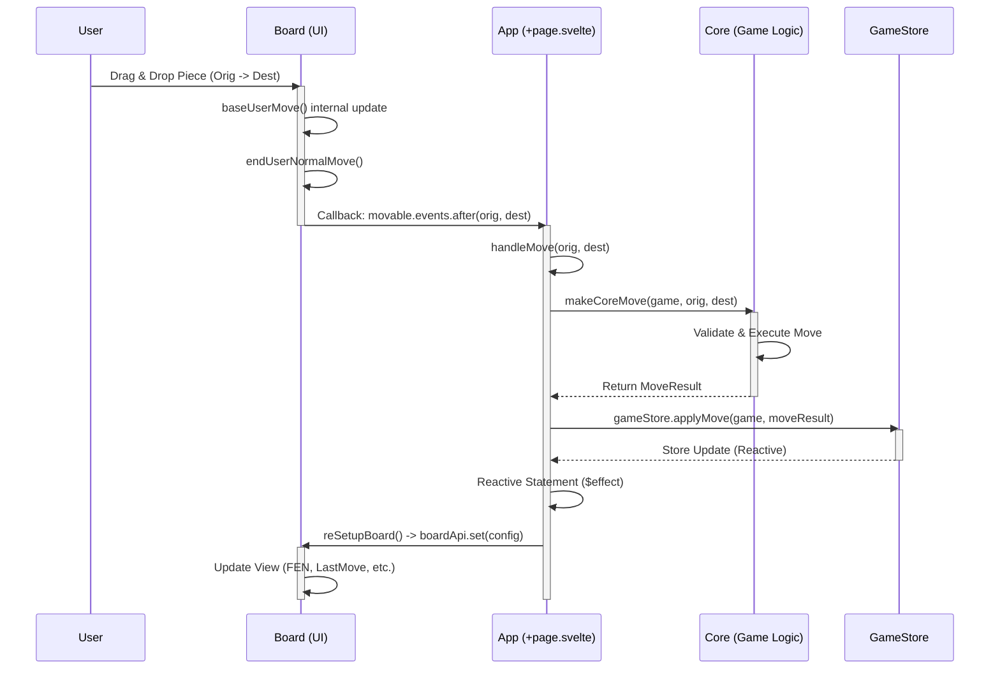
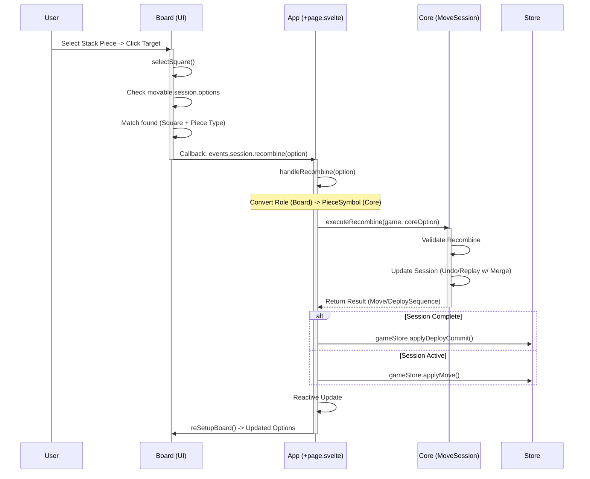

# CoTuLenh Architecture: Move & Recombine Flows

This document outlines the data and control flow for "Standard Moves" and "Recombine Actions" across the three main layers of the application:

1.  **Board (`cotulenh-board`)**: The UI / View layer.
2.  **App (`cotulenh-app`)**: The Controller / Integration layer.
3.  **Core (`cotulenh-core`)**: The Model / Game Logic layer.

## 1. Move Flow

The move flow describes how a standard piece movement is initiated by the user, validated, executed, and reflected back in the UI.

### Flow Diagram

### Detailed Steps

1.  **Board Interaction**:
    - The user drags a piece on the visual board.
    - `board.ts` handles the drag via `selectSquare` and `userMove`.
    - Optimistic UI update happens in `baseMove`, moving the piece visually immediately.
    - Upon completion, `endUserNormalMove` triggers the configured callback `state.movable.events.after`.

2.  **App Handling**:
    - The `+page.svelte` component binds this callback to `handleMove`.
    - `handleMove` receives the origin and destination.
    - It invokes the core logic via `makeCoreMove` (or directly via `game.move` wrapper).

3.  **Core Execution**:
    - The Core validates the move (legality, turn, checks).
    - It updates the internal game state (FEN, history, turn).
    - It returns a `MoveResult` object.

4.  **State Update & Feedback**:
    - The App updates the global `gameStore` with `applyMove`.
    - Svelte's reactivity detects the change in `gameStore` (or `uiDeployState`).
    - The `$effect` block in `+page.svelte` triggers `reSetupBoard`.
    - `reSetupBoard` sends a new configuration object to the Board (including the new FEN, `lastMove` highlight, and valid destinations).
    - The Board reconciles its state with the new config, ensuring the visual state matches the logical state.

---

## 2. Recombine Flow

The recombine flow is specific to the "Deploy" phase, where a piece from a stack can move onto a square already occupied by a friendly piece to form a combined unit (e.g., Infantry + Tank).

### Flow Diagram

### Detailed Steps

1.  **Selection & Detection**:
    - The user selects a piece from a stack (typically the `stackSquare` during deployment).
    - They click on a destination square that already has a piece.
    - In `board.ts`, `selectSquare` checks if the `movable.session.options` array contains a match for the selected piece type and target square.
    - These options were pre-calculated by the Core and passed down to the Board in the previous render cycle.

2.  **Triggering Recombine**:
    - If a matching `RecombineOption` is found, `board.ts` does **not** perform a standard move.
    - Instead, it immediately calls `state.movable.events.session.recombine(option)`.
    - The mapping converts the Board's `RecombineOption` (using `Key` and `Role`) to the App's handler.

3.  **App Handling**:
    - `+page.svelte`'s `handleRecombine` function intercepts the call.
    - It translates the Board's `Role` (e.g., `'tank'`) back to the Core's `PieceSymbol` (e.g., `'t'`) using `roleToType`.
    - It calls `executeRecombine` from `cotulenh-core`.

4.  **Core Execution**:
    - `executeRecombine` in `move-session.ts` is complex:
      - It validates the combination (e.g., checking if `Tank` + `Infantry` is valid).
      - It modifies the current `MoveSession`. This often involves "undoing" the deploy moves, modifying the target move to include the combined piece, and replaying the sequence.
    - It returns the updated state.

5.  **State Update**:
    - The App receives the result.
    - It updates the `gameStore`.
    - The cycle continues: App pushes new state -> Board updates, showing the combined piece and potentially new available options.
