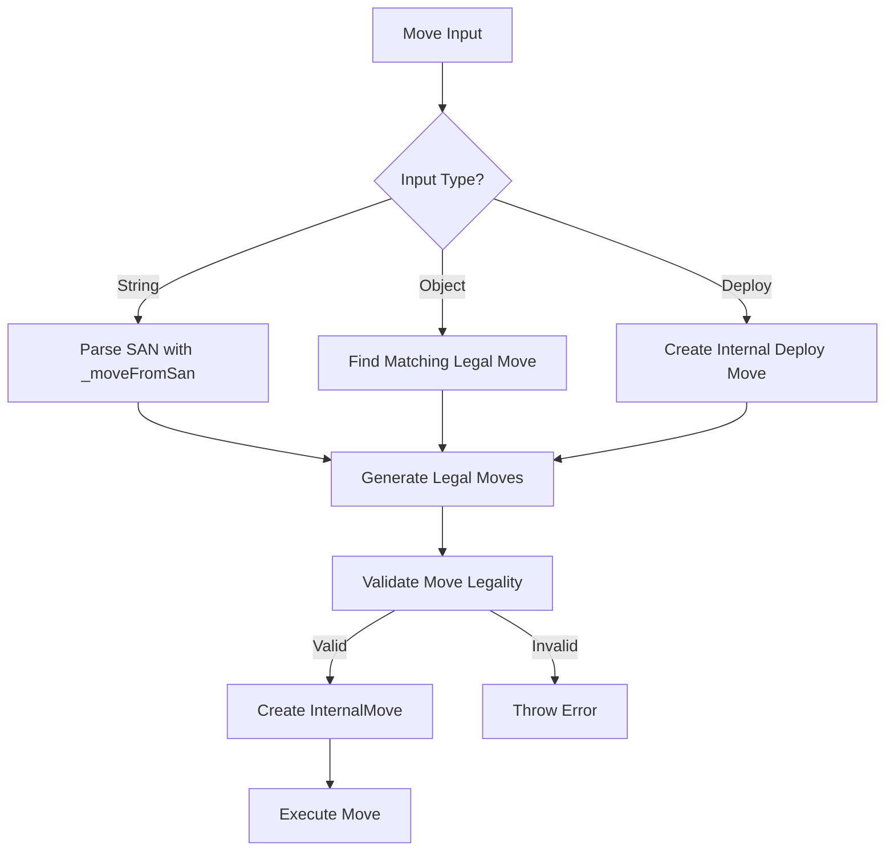

# CoTuLenh API Flow Documentation

## Overview

The CoTuLenh chess variant implements a sophisticated game engine with support
for complex moves, piece stacking, deploy mechanics, and comprehensive history
management. This document details the complete API flow from move initiation to
game state updates.

## Core Architecture

### Main Components

1. **CoTuLenh Class**: Main game engine
2. **Command Pattern**: Move execution via atomic actions
3. **History System**: Complete game state tracking
4. **Move Generation**: Legal move calculation
5. **Board Representation**: 0x88 format for 11×12 board

### Key Data Structures

```typescript
// Internal board representation
private _board = new Array<Piece | undefined>(256) // 0x88 format
private _turn: Color = RED
private _commanders: Record<Color, number> = { r: -1, b: -1 }
private _halfMoves = 0
private _moveNumber = 1
private _history: History[] = []
private _deployState: DeployState | null = null
```

## Move Execution Flow

### 1. Move Input Processing

The API accepts moves in multiple formats:

#### String Format (SAN)

```typescript
game.move('Tc3') // Normal move
game.move('Txd4') // Capture
game.move('T_d4') // Stay capture
game.move('(T|I)c2>c3') // Deploy move
game.move('T&e6(T|I)') // Combination move
```

#### Object Format

```typescript
game.move({
  from: 'c2',
  to: 'c3',
  piece: 't', // Optional piece type filter
  stay: false, // Optional stay capture flag
  deploy: false, // Optional deploy flag
})
```

#### Deploy Move Format

```typescript
game.deployMove({
  from: 'c2',
  moves: [
    { piece: 't', to: 'c3' },
    { piece: 'i', to: 'd3', capture: true },
  ],
  stay: { pieces: ['i'] }, // Optional pieces that stay
})
```

### 2. Move Parsing and Validation



### 3. Internal Move Execution (\_makeMove)

The `_makeMove` method orchestrates the complete move execution:

```typescript
private _makeMove(move: InternalMove | InternalDeployMove) {
  // 1. Create Command Object
  let moveCommand: CTLMoveCommandInteface
  if (isInternalDeployMove(move)) {
    moveCommand = new DeployMoveCommand(this, move)
  } else {
    moveCommand = createMoveCommand(this, move)
  }

  // 2. Store Pre-Move State
  const preState = {
    commanders: { ...this._commanders },
    turn: this._turn,
    halfMoves: this._halfMoves,
    moveNumber: this._moveNumber,
    deployState: this._deployState
  }

  // 3. Execute Command (Atomic Actions)
  moveCommand.execute()

  // 4. Store in History
  this._history.push({
    move: moveCommand,
    ...preState
  })

  // 5. Update Game State
  this._updateGameState(move)
}
```

### 4. Command Execution (Atomic Actions)

Each move type uses specific atomic actions:

#### Normal Move

```typescript
class NormalMoveCommand extends CTLMoveCommand {
  protected buildActions(): void {
    const pieceThatMoved = getMovingPieceFromInternalMove(this.game, this.move)

    // Origin square action
    if (!isStackMove(this.move)) {
      this.actions.push(new RemovePieceAction(this.game, this.move.from))
    }

    // Destination square action
    this.actions.push(
      new PlacePieceAction(this.game, this.move.to, pieceThatMoved),
    )
  }
}
```

#### Capture Move

```typescript
class CaptureMoveCommand extends CTLMoveCommand {
  protected buildActions(): void {
    // Validate capture target
    const capturedPieceData = this.game.get(this.move.to)
    if (!capturedPieceData || capturedPieceData.color !== them) {
      throw new Error(`Capture target invalid`)
    }

    // Same actions as normal move (PlacePieceAction handles capture)
    if (!isStackMove(this.move)) {
      this.actions.push(new RemovePieceAction(this.game, this.move.from))
    }
    this.actions.push(
      new PlacePieceAction(this.game, this.move.to, pieceThatMoved),
    )
  }
}
```

#### Deploy Move

```typescript
class SingleDeployMoveCommand extends CTLMoveCommand {
  protected buildActions(): void {
    // Remove piece from stack
    this.actions.push(
      new RemoveFromStackAction(this.game, this.move.from, this.move.piece),
    )

    // Handle capture if needed
    if (this.move.flags & (BITS.CAPTURE | BITS.SUICIDE_CAPTURE)) {
      this.actions.push(new RemovePieceAction(this.game, destSq))
    }

    // Place deployed piece
    if ((this.move.flags & BITS.SUICIDE_CAPTURE) === 0) {
      this.actions.push(
        new PlacePieceAction(this.game, destSq, this.move.piece),
      )
    }

    // Update deploy state
    this.actions.push(new SetDeployStateAction(this.game, newDeployState))
  }
}
```

### 5. Atomic Actions Details

#### RemovePieceAction (Origin Square Handler)

```typescript
class RemovePieceAction implements CTLAtomicMoveAction {
  execute(): void {
    const piece = this.game.get(this.square)
    if (piece) {
      this.removedPiece = { ...piece } // Store for undo
      this.game.remove(algebraic(this.square))
    }
  }

  undo(): void {
    if (this.removedPiece) {
      this.game.put(this.removedPiece, algebraic(this.square))
    }
  }
}
```

#### PlacePieceAction (Destination Square Handler)

```typescript
class PlacePieceAction implements CTLAtomicMoveAction {
  execute(): void {
    const piece = this.game.get(this.square)
    if (piece) {
      this.existingPiece = { ...piece } // Store captured piece
    }
    this.game.put(this.piece, algebraic(this.square))
  }

  undo(): void {
    if (this.existingPiece) {
      this.game.put(this.existingPiece, algebraic(this.square))
    } else {
      this.game.remove(algebraic(this.square))
    }
  }
}
```

## History Management System

### History Structure

```typescript
interface History {
  move: CTLMoveCommandInteface // Complete command with undo capability
  commanders: Record<Color, number> // Commander positions before move
  turn: Color // Turn before move
  halfMoves: number // Half-move clock before move
  moveNumber: number // Move number before move
  deployState: DeployState | null // Deploy state before move
}
```

### History Operations

#### Adding to History

```typescript
// During _makeMove
const historyEntry: History = {
  move: moveCommand,
  commanders: preCommanderState,
  turn: preTurn,
  halfMoves: preHalfMoves,
  moveNumber: preMoveNumber,
  deployState: preDeployState,
}
this._history.push(historyEntry)
```

#### Undoing Moves

```typescript
private _undoMove(): InternalMove | InternalDeployMove | null {
  const old = this._history.pop()
  if (!old) return null

  // Restore game state BEFORE command execution
  this._commanders = old.commanders
  this._turn = old.turn
  this._halfMoves = old.halfMoves
  this._moveNumber = old.moveNumber
  this._deployState = old.deployState

  // Undo board changes
  old.move.undo()

  return old.move.move
}
```

#### Retrieving History

```typescript
// Get move history as strings
const moves = game.history() // ["Tc3", "Id4", "Txd4", ...]

// Get detailed move objects
const detailedMoves = game.history({ verbose: true })
// [Move, Move, DeployMove, ...]
```

## Game State Management

### Turn Management

```typescript
// Normal moves switch turns
if (!isInternalDeployMove(move) && !(move.flags & BITS.DEPLOY)) {
  this._turn = swapColor(this._turn)
}
// Deploy moves maintain current turn until complete
```

### Move Counter Updates

```typescript
// Reset half-move clock on capture
if (moveCommand.move.captured) {
  this._halfMoves = 0
} else {
  this._halfMoves++
}

// Increment full move number after Blue's turn
if (us === BLUE && !(move.flags & BITS.DEPLOY)) {
  this._moveNumber++
}
```

### Deploy State Management

```typescript
// Deploy state tracks multi-move sequences
type DeployState = {
  stackSquare: number // Original stack location
  turn: Color // Player executing deploy
  originalPiece: Piece // Original stack composition
  movedPieces: Piece[] // Pieces already deployed
  stay?: Piece[] // Pieces remaining in stack
}
```

## Move Generation and Validation

### Legal Move Generation

```typescript
private _moves({
  legal = true,
  pieceType = undefined,
  square = undefined,
  deploy = false
}): InternalMove[] {
  // Generate moves based on game state
  if (this._deployState || deploy) {
    return generateDeployMoves(this, deploySquare, pieceType)
  } else {
    return generateNormalMoves(this, this._turn, pieceType, square)
  }
}
```

### Move Legality Filtering

```typescript
private _filterLegalMoves(moves: InternalMove[], us: Color): InternalMove[] {
  const legalMoves = []
  for (const move of moves) {
    this._makeMove(move)
    // Legal if doesn't leave commander attacked or exposed
    if (!this._isCommanderAttacked(us) && !this._isCommanderExposed(us)) {
      legalMoves.push(move)
    }
    this._undoMove()
  }
  return legalMoves
}
```

## API Methods Summary

### Core Move Methods

- `move(moveString | moveObject)`: Execute single move
- `deployMove(deployRequest)`: Execute multi-piece deploy sequence
- `undo()`: Undo last move
- `moves(options)`: Get available legal moves

### Game State Queries

- `turn()`: Current player
- `isCheck()`: Commander under attack
- `isCheckmate()`: Game over by checkmate
- `isDraw()`: Game drawn by rules
- `isGameOver()`: Any terminal condition

### Board Access

- `get(square, pieceType?)`: Get piece at square
- `put(piece, square)`: Place piece (internal use)
- `remove(square)`: Remove piece (internal use)
- `board()`: Get 2D board representation

### History and State

- `history(options)`: Get move history
- `fen()`: Get position string
- `load(fen)`: Load position
- `getHeroicStatus(square, type)`: Check heroic status
- `setHeroicStatus(square, type, heroic)`: Update heroic status

## Error Handling

### Move Validation Errors

```typescript
// Invalid square
throw new Error(`Invalid square in move object: ${JSON.stringify(move)}`)

// No legal moves found
throw new Error(`No matching legal move found: ${JSON.stringify(move)}`)

// Ambiguous moves
throw new Error(`Multiple matching legal moves found: ${JSON.stringify(move)}`)

// Illegal move
throw new Error(`Invalid or illegal move: ${JSON.stringify(move)}`)
```

### Command Execution Errors

```typescript
// Piece placement failures
throw new Error(`Place piece fail: ${JSON.stringify(piece)} ${square}`)

// Invalid capture targets
throw new Error(`Capture target invalid ${algebraic(square)}`)

// Stack manipulation errors
throw new Error(`Request moving piece not found in the stack`)
```

## Performance Considerations

### Move Caching

```typescript
private _movesCache = new QuickLRU<string, InternalMove[]>({ maxSize: 1000 })

// Cache key includes position and context
private _getMovesCacheKey(args): string {
  const fen = this.fen()
  const deployState = this._deployState ? `${this._deployState.stackSquare}:${this._deployState.turn}` : 'none'
  return `${fen}|deploy:${deployState}|legal:${args.legal}|...`
}
```

### Position Tracking

```typescript
private _positionCount: Record<string, number> = {}

// Track for threefold repetition
private _updatePositionCounts(): void {
  const fen = this.fen()
  if (!(fen in this._positionCount)) {
    this._positionCount[fen] = 0
  }
  this._positionCount[fen]++
}
```

## Example Usage Flows

### Basic Move Sequence

```typescript
const game = new CoTuLenh()

// Make moves
const move1 = game.move('Tc3') // Normal move
const move2 = game.move('Id4') // Opponent response
const move3 = game.move('Txd4') // Capture

// Check game state
console.log(game.isCheck()) // false
console.log(game.turn()) // 'b' (Blue's turn)
console.log(game.history()) // ["Tc3", "Id4", "Txd4"]

// Undo last move
game.undo()
console.log(game.history()) // ["Tc3", "Id4"]
```

### Deploy Move Sequence

```typescript
// Start deploy from stack
const deployMove = game.deployMove({
  from: 'c2',
  moves: [
    { piece: 't', to: 'c3' },
    { piece: 'i', to: 'd3', capture: true },
  ],
  stay: { pieces: ['i'] },
})

// Deploy state is now active
console.log(game.getDeployState()) // DeployState object

// Continue with individual deploy moves
game.move('(I)c2>e3') // Deploy remaining infantry
```

This documentation provides a comprehensive overview of how the CoTuLenh API
handles move execution, history management, and game state updates through its
sophisticated command pattern architecture.
