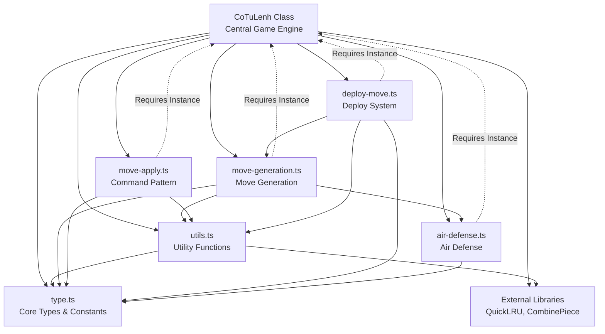

# CoTuLenh Codebase Dependency Analysis

## Overview

This document provides a comprehensive analysis of the CoTuLenh codebase
structure, focusing on dependencies, singleton patterns, and architectural
relationships between components.

## Core Architecture Pattern

The codebase follows a **centralized singleton pattern** with the `CoTuLenh`
class serving as the main game engine that orchestrates all game logic. This
creates a hub-and-spoke architecture where most components depend on or interact
with the central game instance.

## Class Structure and Dependencies

### 1. Core Game Engine (`src/cotulenh.ts`)

**Primary Class**: `CoTuLenh`

- **Role**: Central game state manager and orchestrator
- **Pattern**: Singleton-like behavior (single instance manages entire game
  state)
- **Dependencies**:
  - `type.ts` - Core type definitions and constants
  - `utils.ts` - Utility functions for piece manipulation and validation
  - `move-generation.ts` - Move generation algorithms
  - `move-apply.ts` - Command pattern for move execution
  - `deploy-move.ts` - Deploy move handling
  - `air-defense.ts` - Air defense system calculations

**Key Singleton State**:

```typescript
private _board = new Array<Piece | undefined>(256)
private _turn: Color = RED
private _commanders: Record<Color, number> = { r: -1, b: -1 }
private _halfMoves = 0
private _moveNumber = 1
private _history: History[] = []
private _deployState: DeployState | null = null
private _airDefense: AirDefense = { [RED]: new Map(), [BLUE]: new Map() }
private _movesCache = new QuickLRU<string, InternalMove[]>({ maxSize: 1000 })
```

### 2. Type System (`src/type.ts`)

**Role**: Central type definitions and constants

- **Pattern**: Pure module (no state, only definitions)
- **Dependencies**: None (foundational layer)
- **Exports**: All core types, constants, and enums used throughout the system

**Key Exports**:

- Piece types and symbols
- Board representation constants (SQUARE_MAP, NAVY_MASK, LAND_MASK)
- Move flags and internal move structures
- Game state types (DeployState, AirDefense, etc.)

### 3. Utility Functions (`src/utils.ts`)

**Role**: Pure functions for piece manipulation and game logic

- **Pattern**: Functional utilities (stateless)
- **Dependencies**:
  - `type.ts` - Type definitions
  - `@repo/cotulenh-combine-piece` - External piece combination logic

**Key Functions**:

- Piece manipulation: `flattenPiece()`, `createCombinedPiece()`, `clonePiece()`
- Board utilities: `printBoard()`, `getDisambiguator()`
- Move utilities: `addMove()`, `createAllPieceSplits()`

### 4. Move Generation (`src/move-generation.ts`)

**Role**: Algorithms for generating legal moves

- **Pattern**: Strategy pattern with configuration-driven behavior
- **Dependencies**:
  - `type.ts` - Core types
  - `utils.ts` - Utility functions
  - `air-defense.ts` - Air defense calculations
  - Requires `CoTuLenh` instance for board state access

**Key Components**:

- `BASE_MOVEMENT_CONFIG` - Configuration for each piece type
- `generateMovesForPiece()` - Core move generation algorithm
- `generateDeployMoves()` - Deploy phase move generation
- `generateNormalMoves()` - Standard move generation

### 5. Move Application (`src/move-apply.ts`)

**Role**: Command pattern implementation for move execution

- **Pattern**: Command pattern with atomic actions
- **Dependencies**:
  - `type.ts` - Core types
  - `utils.ts` - Utility functions
  - Requires `CoTuLenh` instance for state modification

**Key Components**:

- `CTLMoveCommand` - Abstract base command
- Concrete commands: `NormalMoveCommand`, `CaptureMoveCommand`,
  `DeployMoveCommand`
- Atomic actions: `RemovePieceAction`, `PlacePieceAction`,
  `SetDeployStateAction`

### 6. Deploy Move System (`src/deploy-move.ts`)

**Role**: Specialized handling for stack deployment moves

- **Pattern**: Complex move orchestration
- **Dependencies**:
  - `type.ts` - Core types
  - `utils.ts` - Utility functions
  - `move-generation.ts` - Move generation utilities
  - Requires `CoTuLenh` instance for validation

**Key Components**:

- `InternalDeployMove` - Deploy move representation
- `DeployMove` - Public deploy move class
- `generateStackSplitMoves()` - Stack splitting algorithms

### 7. Air Defense System (`src/air-defense.ts`)

**Role**: Air defense zone calculations and air force movement restrictions

- **Pattern**: Specialized calculation module
- **Dependencies**:
  - `type.ts` - Core types
  - Requires `CoTuLenh` instance for board state

**Key Components**:

- `calculateAirDefense()` - Zone calculation
- `getCheckAirDefenseZone()` - Movement validation
- `AirDefenseResult` - Movement outcome enumeration

## Dependency Graph



## Circular Dependencies and Tight Coupling

### 1. Central Hub Pattern

The `CoTuLenh` class creates a circular dependency pattern where:

- It imports and uses all other modules
- Other modules require a `CoTuLenh` instance to function
- This creates tight coupling but enables centralized state management

### 2. Specific Circular Dependencies

**CoTuLenh ↔ Move Generation**:

- `CoTuLenh` imports `generateNormalMoves`, `generateDeployMoves`
- Move generation functions require `CoTuLenh` instance for board access
- **Coupling Point**: `gameInstance` parameter in move generation functions

**CoTuLenh ↔ Move Application**:

- `CoTuLenh` imports command classes
- Commands require `CoTuLenh` instance for state modification
- **Coupling Point**: `game` parameter in command constructors

**CoTuLenh ↔ Deploy Move System**:

- `CoTuLenh` imports deploy move utilities
- Deploy functions require `CoTuLenh` instance for validation
- **Coupling Point**: Game instance passed to deploy functions

**CoTuLenh ↔ Air Defense**:

- `CoTuLenh` imports air defense calculations
- Air defense requires `CoTuLenh` instance for board state
- **Coupling Point**: Game instance in air defense functions

### 3. Tight Coupling Points

1. **Board State Access**: All modules need access to the central board state
2. **Move Validation**: Move generation requires game state for legal move
   filtering
3. **State Modification**: Commands need direct access to game internals
4. **Cache Management**: Move cache is tightly coupled to game state changes

## Global State Dependencies

### 1. Centralized Game State

All game state is centralized in the `CoTuLenh` class:

- Board position (`_board`)
- Turn management (`_turn`, `_moveNumber`, `_halfMoves`)
- Commander positions (`_commanders`)
- Deploy state (`_deployState`)
- Air defense zones (`_airDefense`)
- Move history (`_history`)
- Position counts (`_positionCount`)

### 2. State Synchronization

The singleton pattern ensures state consistency but creates dependencies:

- Move generation depends on current board state
- Air defense calculations depend on piece positions
- Deploy state affects available moves
- Commander positions affect check detection

### 3. Cache Dependencies

The move cache (`_movesCache`) creates additional coupling:

- Cache keys depend on FEN, deploy state, and move parameters
- Cache invalidation tied to state changes
- Performance optimization creates additional complexity

## Architectural Implications

### Strengths

1. **Centralized Control**: Single point of truth for game state
2. **Consistency**: All components work with the same state
3. **Performance**: Caching and state reuse
4. **Atomicity**: Command pattern ensures consistent state updates

### Weaknesses

1. **Tight Coupling**: Difficult to test components in isolation
2. **Circular Dependencies**: Complex import relationships
3. **Monolithic Design**: Large central class with many responsibilities
4. **State Mutation**: Direct state modification creates side effects

### Testing Challenges

1. **Mock Complexity**: Difficult to mock the central game instance
2. **State Setup**: Complex state setup required for unit tests
3. **Isolation**: Hard to test individual components independently
4. **Side Effects**: State mutations affect multiple test scenarios

## Recommendations for Analysis

1. **Extract Interfaces**: Define interfaces for game state access to reduce
   coupling
2. **Dependency Injection**: Pass required state as parameters instead of full
   game instance
3. **State Immutability**: Consider immutable state updates to reduce side
   effects
4. **Module Boundaries**: Clearer separation between pure functions and stateful
   operations
5. **Event System**: Consider event-driven architecture for state change
   notifications
