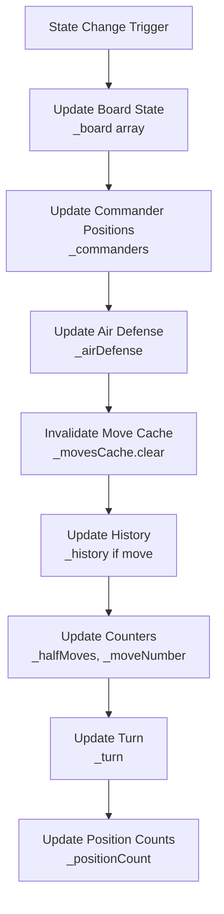

# CoTuLenh Data Flow Analysis

## Overview

This document traces the complete data flow through the CoTuLenh game engine,
from move input through validation, execution, state updates, and response
generation. It maps how data transforms and flows through the singleton system.

## Core Data Flow Patterns

### 1. Request-Response Cycle

The CoTuLenh engine follows a consistent request-response pattern:

```
Input → Parsing → Validation → Execution → State Update → Response
```

### 2. State-Centric Architecture

All data flows through the central `CoTuLenh` instance state:

- **Input Processing**: External data converted to internal representations
- **State Queries**: Components read from centralized state
- **State Mutations**: Commands modify centralized state atomically
- **Response Generation**: Internal state converted to external formats

## Detailed Data Flow Traces

### A. Move Input → Validation → Execution → State Update → Response

#### 1. Move Input Processing

**Entry Points**:

- `move(string | object)` - Main move execution method
- `deployMove(DeployMoveRequest)` - Deploy move execution

**Data Transformation Flow**:

```typescript
// Input: SAN string (e.g., "Nf3") or move object
move(input: string | MoveObject)
  ↓
// Parse input to internal representation
if (typeof input === 'string') {
  internalMove = _moveFromSan(input, strict)
} else {
  // Convert move object to internal format
  internalMove = findMatchingLegalMove(input)
}
  ↓
// Validate move exists and is legal
if (!internalMove) throw Error("Invalid move")
  ↓
// Create public Move object for response
prettyMove = new Move(this, internalMove)
  ↓
// Execute the move
_makeMove(internalMove)
  ↓
// Return response
return prettyMove
```

#### 2. SAN Parsing Data Flow

**Method**: `_moveFromSan(move: string, strict: boolean)`

```typescript
// Input: SAN string (e.g., "+Nf3x", "Td4>e5")
cleanMove = strippedSan(move) // Remove annotations: "+Nf3x" → "Nf3x"
  ↓
pieceType = inferPieceType(cleanMove) // Extract piece: "Nf3x" → 'n'
  ↓
legalMoves = _moves({ legal: true, pieceType }) // Get all legal moves for piece
  ↓
// Strict parsing: exact SAN match
for (move of legalMoves) {
  [san, lan] = _moveToSanLan(move, legalMoves)
  if (cleanMove === strippedSan(san) || cleanMove === strippedSan(lan)) {
    return move // Exact match found
  }
}
  ↓
// Permissive parsing: regex pattern matching
regex = /^(\(.*\))?(\+)?([CITMEAGSFNH])?([a-k]?(?:1[0-2]|[1-9])?)([x<>\+&-]|>x)?([a-k](?:1[0-2]|[1-9]))([#\^]?)?$/
matches = cleanMove.match(regex)
  ↓
// Extract components: heroic, piece, from, flag, to, check
heroic = matches[2]    // "+"
pieceType = matches[3] // "N"
from = matches[4]      // "f3" or "f" or "3"
flag = matches[5]      // "x", ">", etc.
to = matches[6]        // "e5"
check = matches[7]     // "#", "^"
  ↓
// Find matching legal move by components
return matchingInternalMove
```

#### 3. Move Validation Data Flow

**Method**: `_moves({ legal: true, ... })`

```typescript
// Generate all pseudo-legal moves
if (deployState && deployState.turn === us) {
  allMoves = generateDeployMoves(this, deployState.stackSquare, filterPiece)
} else {
  allMoves = generateNormalMoves(this, us, filterPiece, filterSquare)
}
  ↓
// Filter illegal moves (leaving commander in check/exposed)
legalMoves = _filterLegalMoves(allMoves, us)
  ↓
// Cache results
_movesCache.set(cacheKey, legalMoves)
  ↓
return legalMoves
```

**Legal Move Filtering**:

```typescript
_filterLegalMoves(moves, us) {
  legalMoves = []
  for (move of moves) {
    _makeMove(move)           // Try the move
    if (!_isCommanderAttacked(us) && !_isCommanderExposed(us)) {
      legalMoves.push(move)   // Move is legal
    }
    _undoMove()              // Undo the try
  }
  return legalMoves
}
```

#### 4. Move Execution Data Flow

**Method**: `_makeMove(move: InternalMove | InternalDeployMove)`

```typescript
// 1. Create command object
if (isInternalDeployMove(move)) {
  moveCommand = new DeployMoveCommand(this, move)
} else {
  moveCommand = createMoveCommand(this, move)
}
  ↓
// 2. Store pre-move state
preCommanderState = { ...this._commanders }
preTurn = this._turn
preHalfMoves = this._halfMoves
preMoveNumber = this._moveNumber
preDeployState = this._deployState
  ↓
// 3. Execute command (atomic board changes)
moveCommand.execute()
  ↓
// 4. Store history entry
historyEntry = {
  move: moveCommand,
  commanders: preCommanderState,
  turn: preTurn,
  halfMoves: preHalfMoves,
  moveNumber: preMoveNumber,
  deployState: preDeployState
}
this._history.push(historyEntry)
  ↓
// 5. Update game state
if (captured) this._halfMoves = 0
else this._halfMoves++

if (us === BLUE && !isDeployMove) this._moveNumber++

if (!isDeployMove) this._turn = swapColor(us)
  ↓
// 6. Update position counts
_updatePositionCounts()
```

#### 5. Command Pattern Data Flow

**Command Creation**:

```typescript
createMoveCommand(game, move) {
  if (move.flags & BITS.DEPLOY) return new SingleDeployMoveCommand(game, move)
  if (move.flags & BITS.SUICIDE_CAPTURE) return new SuicideCaptureMoveCommand(game, move)
  if (move.flags & BITS.STAY_CAPTURE) return new StayCaptureMoveCommand(game, move)
  if (move.flags & BITS.COMBINATION) return new CombinationMoveCommand(game, move)
  if (move.flags & BITS.CAPTURE) return new CaptureMoveCommand(game, move)
  return new NormalMoveCommand(game, move)
}
```

**Command Execution**:

```typescript
// Each command builds atomic actions
buildActions() {
  this.actions = [
    new RemovePieceAction(game, fromSquare),
    new PlacePieceAction(game, toSquare, piece),
    new SetDeployStateAction(game, newDeployState),
    new CheckAndPromoteAttackersAction(game, move)
  ]
}
  ↓
// Execute all actions in sequence
execute() {
  for (action of this.actions) {
    action.execute()
  }
}
  ↓
// Each action modifies game state directly
RemovePieceAction.execute() {
  this.removedPiece = game.get(square)
  game.remove(algebraic(square))
}
```

### B. FEN Parsing → Internal Representation → Board State → Piece Objects

#### 1. FEN Loading Data Flow

**Method**: `load(fen: string, options)`

```typescript
// Input: FEN string
"6c4/1n2fh1hf2/3a2s2a1/2n1gt1tg2/2ie2m2ei/11/11/2IE2M2EI/2N1GT1TG2/3A2S2A1/1N2FH1HF2/6C4 r - - 0 1"
  ↓
// Parse FEN tokens
tokens = fen.split(/\s+/)
position = tokens[0]  // Board position
turn = tokens[1]      // Active color
halfMoves = tokens[4] // Half-move clock
moveNumber = tokens[5] // Full-move number
  ↓
// Clear current state
clear({ preserveHeaders })
  ↓
// Parse board position
ranks = position.split('/') // Split into 12 ranks
  ↓
// Process each rank
for (r = 0; r < 12; r++) {
  col = 0
  parsingStack = false
  nextHeroic = false

  for (char of ranks[r]) {
    if (isDigit(char)) {
      col += parseInt(char)  // Skip empty squares
    } else if (char === '+') {
      nextHeroic = true      // Next piece is heroic
    } else if (char === '(') {
      parsingStack = true    // Start stack notation
    } else if (char === ')') {
      parsingStack = false   // End stack notation
      col++
    } else {
      // Parse piece
      color = char < 'a' ? RED : BLUE
      piece = {
        type: char.toLowerCase(),
        color: color,
        heroic: nextHeroic
      }
      this.put(piece, algebraic(r * 16 + col), true)
      if (!parsingStack) col++
      nextHeroic = false
    }
  }
}
  ↓
// Set game state
this._turn = turn
this._halfMoves = halfMoves
this._moveNumber = moveNumber
  ↓
// Update derived state
_updatePositionCounts()
_airDefense = updateAirDefensePiecesPosition(this)
```

#### 2. Internal Board Representation

**0x88 Board System**:

```typescript
// 256-element array representing 16x16 grid
_board = new Array<Piece | undefined>(256)

// Square mapping: algebraic → internal index
SQUARE_MAP = {
  a12: 0x00, b12: 0x01, ..., k12: 0x0A,  // Rank 12
  a11: 0x10, b11: 0x11, ..., k11: 0x1A,  // Rank 11
  ...
  a1: 0xB0,  b1: 0xB1,  ..., k1: 0xBA   // Rank 1
}

// Coordinate extraction
rank(square) = square >> 4      // Upper 4 bits
file(square) = square & 0xf     // Lower 4 bits

// Board boundaries
isSquareOnBoard(sq) {
  r = rank(sq)
  f = file(sq)
  return r >= 0 && r < 12 && f >= 0 && f < 11
}
```

#### 3. Piece Object Structure

**Piece Data Flow**:

```typescript
// Basic piece structure
Piece = {
  color: 'r' | 'b',           // RED or BLUE
  type: PieceSymbol,          // 'c', 'i', 't', 'm', etc.
  heroic?: boolean,           // Heroic status
  carrying?: Piece[]          // Carried pieces (for stacks)
}

// Piece placement
put(piece, square, allowCombine) {
  sq = SQUARE_MAP[square]

  // Terrain validation
  if (piece.type === NAVY && !NAVY_MASK[sq]) return false
  if (piece.type !== NAVY && !LAND_MASK[sq]) return false

  // Commander limit validation
  if (haveCommander(piece) && this._commanders[color] !== -1) return false

  // Piece combination (if allowed)
  if (allowCombine && existingPiece) {
    allPieces = [...flattenPiece(existingPiece), ...flattenPiece(piece)]
    combinedPiece = createCombineStackFromPieces(allPieces)
    piece = combinedPiece
  }

  // Place piece
  this._board[sq] = piece
  if (haveCommander(piece)) this._commanders[color] = sq

  // Update air defense
  if (BASE_AIRDEFENSE_CONFIG[piece.type]) {
    this._airDefense = updateAirDefensePiecesPosition(this)
  }
}
```

### C. Game State Flow Through Singleton Instances

#### 1. Centralized State Management

**Core State Components**:

```typescript
class CoTuLenh {
  // Board state
  private _board = new Array<Piece | undefined>(256)

  // Game state
  private _turn: Color = RED
  private _halfMoves = 0
  private _moveNumber = 1

  // Special positions
  private _commanders: Record<Color, number> = { r: -1, b: -1 }

  // Game history
  private _history: History[] = []
  private _positionCount: Record<string, number> = {}

  // Deploy state
  private _deployState: DeployState | null = null

  // Air defense system
  private _airDefense: AirDefense = {
    [RED]: new Map<number, number[]>(),
    [BLUE]: new Map<number, number[]>(),
  }

  // Performance optimization
  private _movesCache = new QuickLRU<string, InternalMove[]>({ maxSize: 1000 })
}
```

#### 2. State Access Patterns

**Read Operations**:

```typescript
// Direct state access
get(square, pieceType?) → Piece | undefined
turn() → Color
isCheck() → boolean
fen() → string

// Computed state access
moves(options) → Move[] | string[]
getAttackers(square, color) → AttackerInfo[]
isCheckmate() → boolean
isDraw() → boolean
```

**Write Operations**:

```typescript
// Direct state modification
put(piece, square, allowCombine?) → boolean
remove(square) → Piece | undefined
setHeroicStatus(square, pieceType, heroic) → void

// Complex state changes
move(move) → Move | null
deployMove(deployMove) → DeployMove
undo() → void
load(fen, options) → void
```

#### 3. State Synchronization Flow

**State Update Cascade**:

```typescript
// Piece placement triggers multiple updates
put(piece, square) {
  this._board[sq] = piece                    // Update board
  ↓
  if (haveCommander(piece)) {
    this._commanders[color] = sq             // Update commander position
  }
  ↓
  if (BASE_AIRDEFENSE_CONFIG[piece.type]) {
    this._airDefense = updateAirDefensePiecesPosition(this)  // Update air defense
  }
  ↓
  this._movesCache.clear()                   // Invalidate move cache
}

// Move execution triggers state cascade
_makeMove(move) {
  moveCommand.execute()                      // Execute atomic board changes
  ↓
  this._history.push(historyEntry)          // Update history
  ↓
  this._halfMoves++                         // Update move counters
  this._moveNumber++
  ↓
  this._turn = swapColor(this._turn)        // Switch turn
  ↓
  _updatePositionCounts()                   // Update position tracking
  ↓
  this._movesCache.clear()                  // Invalidate cache
}
```

### D. Data Mutations, Side Effects, and State Changes

#### 1. Atomic Operations

**Command Pattern Ensures Atomicity**:

```typescript
// All board changes are atomic
class CTLMoveCommand {
  protected actions: CTLAtomicMoveAction[] = []

  execute() {
    for (action of this.actions) {
      action.execute() // All succeed or all fail
    }
  }

  undo() {
    for (i = this.actions.length - 1; i >= 0; i--) {
      this.actions[i].undo() // Reverse all changes
    }
  }
}
```

#### 2. Side Effects Tracking

**Move Execution Side Effects**:

```typescript
_makeMove(move) {
  // Primary effect: board state change
  moveCommand.execute()

  // Side effects:
  1. History update: this._history.push(historyEntry)
  2. Turn switch: this._turn = swapColor(this._turn)
  3. Move counters: this._halfMoves++, this._moveNumber++
  4. Position tracking: _updatePositionCounts()
  5. Cache invalidation: this._movesCache.clear()
  6. Commander tracking: updateCommandersPosition()
  7. Air defense update: updateAirDefensePiecesPosition()
  8. Heroic promotion: CheckAndPromoteAttackersAction
}
```

#### 3. State Change Sequence

**Typical Move Execution Sequence**:

```typescript
1. Input Processing
   move("Nf3") → _moveFromSan("Nf3") → InternalMove

2. Validation
   _moves({ legal: true }) → _filterLegalMoves() → legal moves list

3. Pre-execution State Capture
   preState = { commanders, turn, halfMoves, moveNumber, deployState }

4. Atomic Board Changes
   RemovePieceAction.execute() → _board[from] = undefined
   PlacePieceAction.execute() → _board[to] = piece
   CheckAndPromoteAttackersAction.execute() → update heroic status

5. History Recording
   this._history.push({ move: command, ...preState })

6. Game State Updates
   this._halfMoves++ (or reset to 0 if capture)
   this._moveNumber++ (if BLUE moved)
   this._turn = swapColor(this._turn)

7. Derived State Updates
   _updatePositionCounts() → this._positionCount[fen]++
   updateAirDefensePiecesPosition() → this._airDefense = newAirDefense

8. Cache Invalidation
   this._movesCache.clear()

9. Response Generation
   return new Move(this, internalMove)
```

## Data Flow Diagrams

### Move Execution Flow

```mermaid
graph TD
    Input[Move Input<br/>SAN or Object] --> Parse[Parse Input<br/>_moveFromSan]
    Parse --> Validate[Validate Move<br/>_moves + _filterLegalMoves]
    Validate --> Command[Create Command<br/>createMoveCommand]
    Command --> PreState[Capture Pre-State<br/>commanders, turn, etc.]
    PreState --> Execute[Execute Command<br/>Atomic Board Changes]
    Execute --> History[Update History<br/>_history.push]
    History --> GameState[Update Game State<br/>turn, counters, etc.]
    GameState --> DerivedState[Update Derived State<br/>air defense, position counts]
    DerivedState --> Cache[Invalidate Cache<br/>_movesCache.clear]
    Cache --> Response[Generate Response<br/>new Move()]
```

### FEN Loading Flow

```mermaid
graph TD
    FEN[FEN String] --> Tokens[Split Tokens<br/>position, turn, etc.]
    Tokens --> Clear[Clear State<br/>reset all fields]
    Clear --> Ranks[Split Ranks<br/>12 rank strings]
    Ranks --> ParseRank[Parse Each Rank<br/>pieces, stacks, heroic]
    ParseRank --> CreatePiece[Create Piece Objects<br/>type, color, heroic]
    CreatePiece --> PlacePiece[Place Pieces<br/>put() method]
    PlacePiece --> SetState[Set Game State<br/>turn, counters]
    SetState --> UpdateDerived[Update Derived State<br/>air defense, position counts]
```

### State Synchronization Flow



## Performance Implications

### 1. Cache Management

- Move cache invalidated on every state change
- Cache keys include FEN, deploy state, and move parameters
- LRU eviction with 1000 entry limit

### 2. State Computation

- Air defense zones recalculated on piece placement/removal
- Position counts updated on every move for repetition detection
- Commander positions tracked separately for performance

### 3. Memory Usage

- Full game history stored for undo functionality
- Position counts accumulate over game lifetime
- Move cache stores computed legal moves

## Error Handling and Validation

### 1. Input Validation

- FEN format validation during load
- Move format validation during parsing
- Square bounds checking throughout

### 2. State Consistency

- Atomic operations prevent partial state updates
- Command pattern enables complete rollback
- Legal move filtering prevents invalid states

### 3. Error Propagation

- Exceptions bubble up from low-level operations
- Move validation catches illegal moves early
- State corruption prevented by atomic operations
